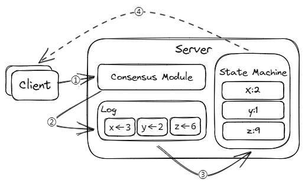
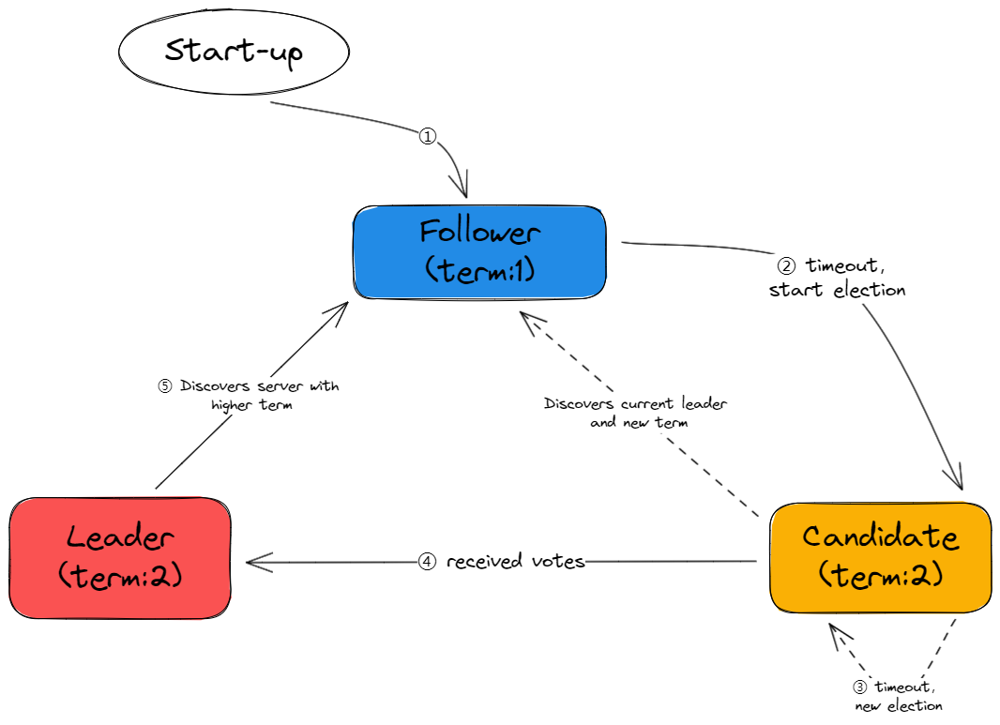
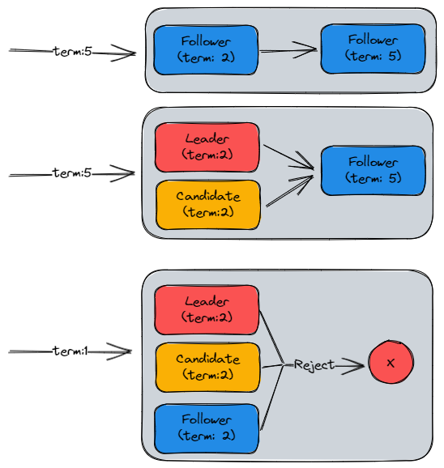
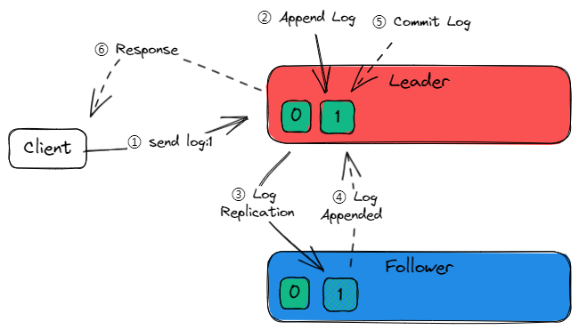
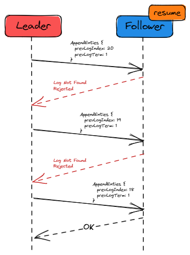
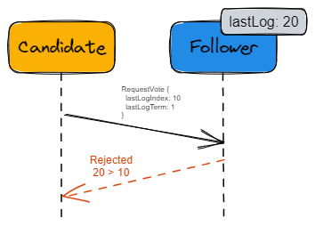
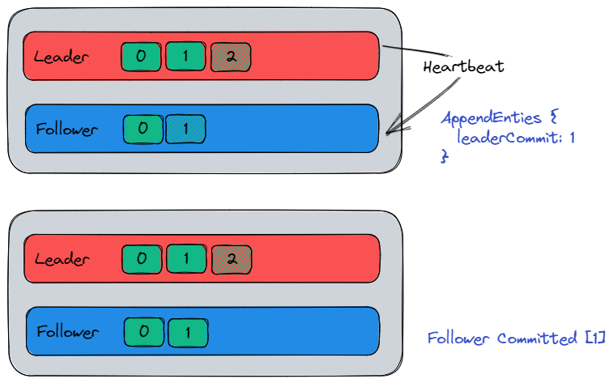

# Raft

## 什么是 Raft ？

相比于 Paxos，Raft **易于理解 (Understandable)**，如何做到易于理解？

> [Raft 分布式共识算法动画演示 (kailing.pub)](http://www.kailing.pub/raft/index.html)

1. 状态简化
    - 限制，减少状态数量和可能产生的变动
2. 问题拆分
    1. 🧑‍💼Leader Election (领导者选举)
    2. 📃Log Replication (日志复制)
    3. 🦺Safety (安全性)

## Replicated State Machine (复制状态机)



**相同的结束状态 = 相同的初始状态 + 相同的输入.**

保障数据状态一致

> 拓展：
   复制状态机功能可以更强大，一个副本采用行存储数据结构存储 (OLTP)，另一个采用列存 (OLAP)，如 HTAP (TiDB)

## 状态简化

状态任何时刻，三者 **之一** (Paxos 状态会存在共存和互相影响)



## 🧑‍💼Leader Election (领导者选举)

### RequestVote RPC (请求投票)

由 Candidate 选举期间发起。

### 心跳机制

由 Leader 发出 (**随机超时**)，维护任期，否则开始选举。

### 选举 (4)

#### 1. Follower 增加自己 Term

#### 2. 转换到 Candidate 状态

#### 3. 投票给自己

#### 4. 向其他节点发送 RequestVote RPC


## 📃Log Replication (日志复制)

Raft 使用顺序日志复制，避免日志空洞

### AppendEnties RPC (追加条目)

由 Leader 发起，用来**复制日志**和提供一种**心跳机制**

```go
type AppendEntiresRequest struct {
    term int // 自己当前任期号
    leaderId int // 自己ID
    preLogIndex int // 前一个日志号
    preLogTerm int // 前一个日志任期号
    entires []byte // 当前日志体
    leaderCommit int // leader 的已提交日志号
}
```

服务器之间通讯时会 **交换当前任期号**

1. 如果**小了**，**更新**为较大的值
2. Leader / Candidate **过期**了，**变为 Follower**
3. **拒接过期任期号**的请求



### 请求过程 (3)



#### 1 Leader：收到客户端请求

#### 2 Leader：新的条目追加到日志中

- 状态机指令
- leader 任期号
- 日志号

#### 3 Leader：并行发送 AppendEnties RPC 给 Follower

1. 收到超过半数 Follower 的 acks
2. Leader：Commit (提交、本地执行)
3. Leader：返回结果给客户端

### 节点故障

1. Follower 没有响应，网络问题
    - Leader 不断重发 (AppendEnties RPC)
2. Follower 宕机
    - 恢复后 **[一致性检查](#一致性检查)**
3. Leader 宕机
    1. 情况1：旧 Leader 存在未提交日志
         不需要考虑，未提交日志对外是 OK 的，因为 Client 会任务未提交的日志是失败的
    2. 情况2：旧 Leader 恢复后成为 Follower
         一致性检查会被新 Leader 的日志条目覆盖

### 一致性检查



**为什么要逐条向前找？**

>方案一：Follower 发送从哪拉
>方案二：二分查找从哪拉

作者：没必要，不常发生 (鸵鸟算法 / 容忍度)

## 🦺Safety (安全性)

### 规则 1 《Leader 宕机处理：选举限制》

`RequestVote RPC` 包含 Candidate 日志信息，Voter 自己日志更新会**拒绝**该投票请求



> 先比 Term，再比 Index

### 规则 2 《Leader 宕机处理：新 Leader 是否提交之前任期内的日志条目》

心跳 Or 日志



1. 如果某个 Leader 在提交某个日志条目**之前崩溃**了，以后的 Leader 会试图完成该日志条目的 **复制**，复制，而**非提交**，**不能通过心跳提交老日志**。
2. Raft **永远不会**通过计算副本数目的方式来**提交之前任期内的日志条目**，而是使用新 Leader 自己的任期号，才能提交旧 Leader 的日志

### 规则 3 《Follower 和 Candidate 宕机处理》

- 无限重试
- Raft 的 RPC 是幂等的

### 规则 4 《时间与可用性限制》

Raft 整体**不依赖客观时间**，只要满足，就可以维持稳定 Leader：

广播时间 (broadcastTime) < 选举超时时间 (electionTimeout) < 平均故障时间 (MTBF)

> 广播时间由*系统决定*的 (0.5ms ~ 20ms)；平均故障时间时由*系统决定*的；选举超时是**程序决定**的 (10ms ~ 500ms)

## Membership Changes (集群成员变更)

### 改变集群配置

1. 增减节点
2. 替换宕机的机器
3. 改变复制的程度

> 对于分布式系统而言，是**不可能在所有的机器上同一时间应用变更**的，分布式系统**天然的限制**，**防止**变更过程中出现**同一任期两个 Leader (脑裂问题)**

### Joint Consensus (联合一致)

> 两阶段方法，集群先切换到一个**过度配置**，称为**联合一致**

**阶段一：** Leader 发起 $C_{old,new}$，使整个集群**进入联合一致状态**

> **所有** RPC 都要在**新旧两个配置中达到大多数**才算成功

**阶段二：** Leader 发起 $C_{new}$，整个集群进入**新配置状态**

> **所有** RPC 要在**新配置下达到大多数**才算成功

**可能出现宕机阶段：**

1. Leader 在 $C_{old,new}$ 未提交时宕机
2. Leader 在 $C_{old,new}$ 已提交但 $C_{new}$ 未发起时宕机
3. Leader 在 $C_{new}$ 已发起时宕机

**补充规则：**

1. **新增节点**时，需要等新增的节点完成日志同步 (新增节点会被设置为**只读状态**) 再开始集群成员变更。**防止**集群在新节点**还没同步日志时就进入联合一致状态或新配置状态**，**影响**正常命令**日志提交**。
2. **缩减节点**时，Leader **本身** 可能就是要缩减的节点，这时它会在完成 $C_{new}$ 的提交后**自动退位**。发起 $C_{new}$ 后，要退出集群的 Leader 会处在操纵一个不包含它自身的 Raft 集群的状态下，这时它**可以发送 $C_{new}$ 日志，但日志计数时不计自身**。
3. 为**避免**下线的节点**超时选举影响集群运行**，服务器会在它**确信**集群中有 Leader 存在时**拒绝 RequestVote RPC**。
     - 因为 $C_{new}$ 的新 Leader 不会再发送心跳给要退出的节点，如果这些节点没有及时下线，他们会超时增加任期号后发送 RequestVote RPC。虽然他们不可能当选 Leader，但会导致 Raft 集群进入投票选举阶段，影响集群正常运行。
        为解决这个问题，Raft 在 RequestVote RPC 上补充了一个规则：***一个节点如果在最小超时时间之内收到了 RequestVote RPC，那么它会拒绝此 RPC***。这样只要 Follower **连续收到** Leader 的心跳，那么退出集群节点的 RequestVote RPC 就不会影响到 Raft 集群的正常运行了。

## 总结语性能测试

### 深入理解复制状态机

需要同步的数据量按大小进行分类

- **非常小：**
  - 成员信息
  - 配置文件
  - 分布式锁
  - 小容量分布式任务队列
  - 无 Leader 共识算法 (Basic Paxos)
    - Chubby
    - Zookeeper
- **比较大**，但可以拆分为**不相干**的各部分
  - 大规模存储系统
  - 有 Leader 的共识算法 (Multi-Paxois，Raft)
    - GFS
    - HDFS
- 不仅**数据量大**，数据之间还**存在关联**
  - 一个共识算法集群容纳不下所有数据，需要数据分片到多个状态机中
  - 状态机之间通过二阶段提交来保证一致性
  - 支持分布式事务的分布式数据库
    - Spanner
    - OceanBase
    - TiDB
    - 通常会对 Paxos 或 Raft 进行一定的改造，满足事务级的要求

### Raft 基本概念总结

**共识算法三个主要特征：**

1. 保证**非拜占庭**情况下的正确性
2. 保证在**大多数机器**正常情况下**高可用**
3. **不依赖外部时间**保证日志一致性

**区别于其他共识算法的三个特征：**

1. Strong Leader
    - 日志只能从 Leader 流向其他服务器
2. Leader Election
    - 随机计时器进行选举
3. Membership Changes
    - 二阶段提交
    - 联合一致

**no-op 补丁：**

一个节点当选 Leader 后，立即发送一个自己当前任期的**空日志体** AppendEnties RPC。

1. 可以把之前任期内满足提交条件的日志都提交了。
2. 一旦 no-op 完成复制，可以把之前任期内符合提交条件的日志保护起来，从而使他们安全提交，没有日志体，过程是很快的。

> 目前大部分应用于生产系统的 Raft 算法，都启用 no-op

### 集群成员变更拓展

> **联合一致**比较复杂，后续大部分对 Raft 实现中，都使用更简单的**单节点**变更方法

**单节点集群成员变更方法：**

一次只增减一个节点，
> etcd (etcdctl)

**单节点成员变更方法的缺陷：**

1. 联合一致支持**一步完成**机器的替换
    - 联合一致：M(ABC) -> M(ABCDE)
    - 单节点：M(ABC) -> M(ABCD) -> M(ABCDE)
2. 单节点变更过程必然经历**偶数节点的状态**，会**降低集群的高可用性**
    - 网络分区，无法选出 Leader, M(ABC) -> M(ABCD) == M(AB|CD)
    - 解决：优化单节点变更过程中偶数节点集群的大多数概念
3. 连续的两次变更，第一步变更的过程中如果出现了切主，那么紧跟着下一次变更可能出现错误 （**最严重**）
    - 解决方法：新 Leader 必须提交一条自己任期内的 no-op 日志，才能开始单节点集群成员变更

> TiDB 5.0 放弃单节点成员变更，改为**联合一致**

### 日志压缩

**Snapshot (快照技术)：**

1. 每个节点达到一定条件之后，可以把当前日志中的命令都写入自己的快照
2. 删除已写入快照的日志

> 只留最新的 value，类似 Redis AOF Rewrite

如果一个 Follower 落后 Leader 很多，老日志被清理了，Leader 怎么同步 Follower？

> 直接向 Follower 发送自己的快照。

### 只读操作处理

> 线性一致性读 = 强一致性读

**方法一：**

把读操作当成一个 Log，由 Leader 发到所有节点上寻求共识，读 Log 提交后，结果符合线性一致性 (**代价太大，不采用**)。

**方法二优化：**

1. 线性一致性读一定要发往 Leader，如果 Follower 收到，需要**转发**到 Leader。
2. 如果一个 Leader 在它任期内还没提交一个日志，那么它要在提交了一个日志后才能反馈 Client 读请求，(no-op 能优化)。

> 只有提交了日志，Leader 才能确认之前任期哪些日志已被提交，不会出现已提交数据读取不到，**至少需要一轮 RPC** (Leader 确认心跳)，**缺点**：没比写快多少，写最少也是一轮

**更进一步：**

1. 优化 Leader 确认心跳，如果心跳发送时间不到选举超时时间的下界，集群就不能选出一个新的 Leader，这一轮可以不经过心跳确认，直接返回结果。
    > **不建议**，分布式系统中，**时钟偏移，full GC 等情况，通常认为时钟是不可靠的**，尽量不要节省这个 RPC 时间，实际上，大部分业务系统**对读要求没那么高**。
2. 不要求强一致性读，利用 Follower 承载更大读压力
    1. Follower 收到读请求后，向 Leader 请求 readIndex
    2. Follower 等待自身状态机应用日志到 readIndex
    3. Follower 查询状态机结果，返回客户端

### Raft 与 Paxos 比较

Raft 不允许日志空洞这个性能上限，但大部分系统实现，连 Raft 的上限，都是远远没有达到的，所以无需考虑 Raft 本身的瓶颈。

Raft 允许日志空洞的改造 -> ParallelRaft

> 如果允许日志空洞，会**极大增加一致性算法的复杂度**，而 Raft 用简单的规则避免了日志空洞，提高了易理解度，降低了复杂度。

## ParallelRaft

...
