# Leaky Bucket

漏桶算法思想：以**固定速率**消费请求，漏桶容量固定，每次用户请求都得放入桶中，桶满则拒绝请求或等待。达到平滑网络请求的效果。



## 令牌与漏桶的区别

1. 漏桶是出，令牌是进
2. 令牌是允许伸缩

## 漏桶算法和令牌桶算法的选择

漏桶算法与令牌桶算法在表面看起来类似，很容易将两者混淆。但事实上，这两者具有截然不同的特性，且为不同的目的而使用。

漏桶算法与令牌桶算法的区别在于，*漏桶算法* 能够**强行限制数据的传输速率**，*令牌桶算法* 能够在 **限制数据的平均传输速率的同时还允许某种程度的突发传输**。

需要注意的是，在某些情况下，漏桶算法不能够有效地使用网络资源，因为漏桶的漏出速率是固定的，所以即使网络中没有发生拥塞，漏桶算法也不能使某一个单独的数据流达到端口速率。因此，漏桶算法对于存在突发特性的流量来说缺乏效率。而令牌桶算法则能够满足这些具有突发特性的流量。*通常，漏桶算法与令牌桶算法结合起来为网络流量提供更高效的控制*。

## 优点

* 能够**平滑请求数**，使系统以一个**均匀的速率**处理请求
* 容易实现，可以用一个队列／FIFO 来做
* 可以只用很小的内存做到为每个用户限流

## 缺点

* 桶满了以后，新的请求都会被扔掉，系统忙着处理旧请求
* 无法保证请求能够在一个固定的时间内处理完

## Sentinel

```Java
public boolean canPass(Node node, int acquireCount, boolean prioritized) {
        // Pass when acquire count is less or equal than 0.
        if (acquireCount <= 0) {
            return true;
        }
        // Reject when count is less or equal than 0.
        // Otherwise,the costTime will be max of long and waitTime will overflow in some cases.
        if (count <= 0) {
            return false;
        }

        long currentTime = TimeUtil.currentTimeMillis();
        // Calculate the interval between every two requests.
        long costTime = Math.round(1.0 * (acquireCount) / count * 1000);

        // Expected pass time of this request.
        long expectedTime = costTime + latestPassedTime.get();

        if (expectedTime <= currentTime) {
            // Contention may exist here, but it's okay.
            latestPassedTime.set(currentTime);
            return true;
        } else {
            // Calculate the time to wait.
            long waitTime = costTime + latestPassedTime.get() - TimeUtil.currentTimeMillis();
            if (waitTime > maxQueueingTimeMs) {
                return false;
            } else {
                long oldTime = latestPassedTime.addAndGet(costTime);
                try {
                    waitTime = oldTime - TimeUtil.currentTimeMillis();
                    if (waitTime > maxQueueingTimeMs) {
                        latestPassedTime.addAndGet(-costTime);
                        return false;
                    }
                    // in race condition waitTime may <= 0
                    if (waitTime > 0) {
                        Thread.sleep(waitTime);
                    }
                    return true;
                } catch (InterruptedException e) {
                }
            }
        }
        return false;
    }
```
