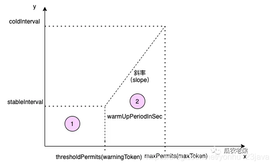

# 令牌桶算法

## 固定生产速度令牌桶

令牌算法是以固定速度往一个桶内增加令牌，当桶内令牌**满了后**，就**停止增加令牌**。上游请求时，先从桶里拿一个令牌，后端只服务有令牌的请求，所以**后端处理速度不一定是匀速**的。当有突发请求过来时，如果令牌桶是满的，则会**瞬间消耗桶中存量**的令牌。如果令牌还不够，那么再**等待发放令牌(固定速度)**，这样就导致处理请求的速度超过发放令牌的速度。

如下图，灰色部分是令牌桶，有容量限制，只能最多存放 capacity 个令牌，每秒以固定的速度向桶中增加令牌，如果桶的容量满了，则等待桶中令牌被消耗后，再增加令牌。另一边应用进程拿到令牌后才处理请求，如果没有拿到令牌，则不处理该请求。



```Java
public class TokenBucket {
     // 桶能承载的最大令牌数
    private long capacity;

    // 放入令牌的速度,系统每毫秒放入的令牌数
    private long refillPeriod;

     // 当前桶中令牌数量
    private long tokens = 0;

    // 记录上次统计时间的毫秒
    private long lastTime = System.currentTimeMillis();

    TokenBucket(long capacity, long refillPeriod) {
        this.capacity = capacity;
        this.refillPeriod = refillPeriod;
    }
 
    /**
     * 功能描述：令牌桶算法
     *
     * @param tokensToConsume 取出多少个令牌
     * @param rate    放入令牌的速度,系统每毫秒放入的令牌数
     * @return true：限流 false：不限流
     */
    public boolean consume(int tokensToConsume) {
         // 当前毫秒
        long millisTime = System.currentTimeMillis();
        // 两次请求的间隔，单位是毫秒
        long time = (millisTime - lastTime);
        // 当前桶中的令牌数
        this.tokens = Math.min(this.capacity, this.tokens + time * this.refillPeriod);
        lastTime = millisTime;
 
        if (this.tokens == 0) {
            // 没有令牌拿
            return true;
        }

        // 拿走令牌
        this.tokens -= tokensToConsume;
        if (this.tokens < 0) {
            this.tokens = 0；
        }
        return false;
    }
}
```

## 预热令牌桶 (令牌生产速率如何控制?)



| 坐标图            | 参数                                                   |
| ----------------- | ------------------------------------------------------ |
| x轴               | 表示令牌桶中的令牌数量                                 |
| y轴               | 生产一个令牌需要的时间(秒)                             |
| stableInterval    | 稳定生产一个令牌需要的时间                             |
| coldInterval      | 生产一个令牌需要的最大时长，与冷启动因子coldFactor有关 |
| warmUpPeriodInSec | 预热时长，默认为10秒。对应到坐标图中为 (2) 梯形面积    |
| thresholdPermits  | 令牌桶中的一个阈值，超过该值时开启预热                 |
| maxPermits        | 令牌桶中最大令牌数                                     |

### 换算关系

`count`：已知由用户设置，例如每秒允许通过100个请求
`warmUpPeriodInSec`：已知由用户设置，默认为10秒，时间区域上红色 (2) 梯形区域
`coldFactor`：假设为3
公式一：`stableInterval = 1/count`
>假如设置阈值每秒允许100个请求通过，则请求发送速率r=100/s
需要令牌生产速率为1/r，即1/100每10毫秒产生一个令牌

公式二：`coldInterval = stableInterval × coldFactor`
公式三：`坐标时间 (1) 长方形区域面积 = 长(thresholdPermits) × 宽(stableInterval)`
公式四：`坐标时间 (1) 长方形区域面积 = 0.5 x warmUpPeriodInSec`
>由于 `coldFactor` 为 3，y轴 `coldInterval - stableInterval = 2 × stableInterval` 的距离两倍，时间区域上红色 (2) 梯形区域是红色 (1) 的长方形区域的两倍。

公式五：`thresholdPermits = 0.5 x warmUpPeriodInSec/stableInterval`
>梯形的面积 = (上底+下底) × 高 ÷ 2 推导出 maxPermits 的值。

公式六：`maxPermits = thresholdPermits + 2 × warmUpPeriodInSec ÷ (stableInterval + coldInterval)`

slope = (coldInterval-stableInterval) ÷ (maxPermits-thresholdPermits)
>由斜率公式 `k=(y1-y2)÷(x1-x2)`，得出斜。

### 原理概述

当令牌桶中的令牌数小于thresholdPermits时，令牌按照固定速率生产，请求流量稳定。当令牌数大于thresholdPermits时，开启预热。此段时期，生产的令牌的速率小于令牌滑落的速度，一段时间后，令牌小于等于thresholdPermits，请求回归到稳定状态，预热结束。

### Sentinel 预热令牌桶

`Sentinel` 中桶中的令牌生产和移除是在**下次请求到来时一起处理**的，另外`Sentinel` 提供的令牌生产公式与当前时间 `currentTime` 有关系，如果一个冷系统好久没有流量，瞬间来了很大流量，此时的桶中令牌数会直接到达最大值 `maxToken` ，这也是官方提供的曲线图中**开始流量比较陡**的原因。
