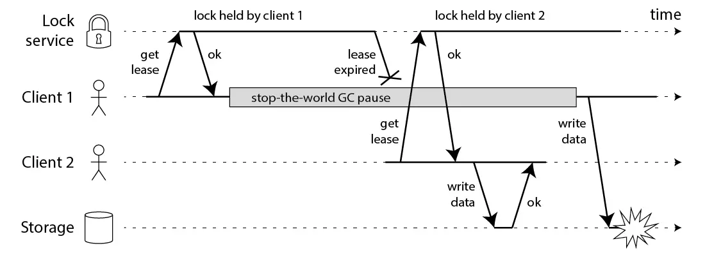
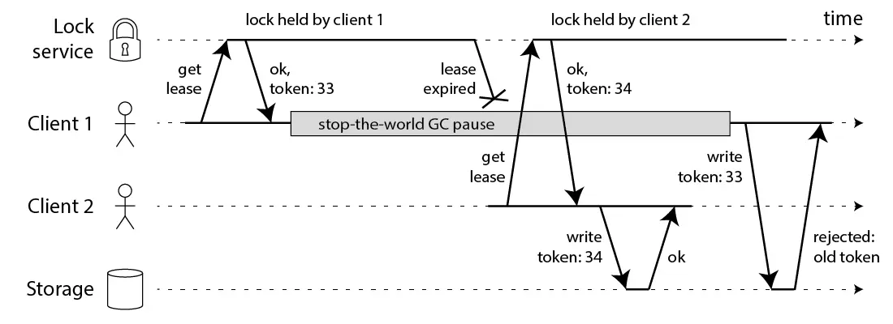

# 分布式锁

## 1 为什么需要分布式锁

> 保护临界区资源原子性

### 1.1 RMW 操作

 实际的业务场景中，有很多并发访问的问题：比如下单，修改库存等，可总结为如下的流程：

```mermaid
flowchart RL
    db[(Database)]-- 1. Read --> m
    subgraph c [Client]
        m([2. Modify])
    end
    m-.3. Write.->db
```

"读取-修改-写回"，简称为 **RMW** 操作（Read-Modify-Write）。

**多个客户端**对**同一份数据**执行 RMW 操作的话，需要让 RMW 和涉及的代码，**按照原子方式执行**，这种访问同一份数据的 RMW 操作代码，叫做**临界区代码**

## 2 Redis 分布式锁

### 2.1 如何防止死锁

- 使用 **`SET $key $value PX xxxx NX`**，设置超时
- Redisson 使用 `LUA` 脚本保证加锁原子性
  - 使用 `Hash` 结构，**`hincrby [name] [uuid:threadId] 1`**，**`pexpire`** 设置锁超时

### 2.2 如何防止释放别人加的锁

- 释放锁时，需要根据当**唯一标识**，在删除时判断**是否为当前客户端加的锁**，这个过程需要使用 **`LUA`** 脚本保证获取和删除的操作为**原子性操作**

### 2.3 锁过期时间多久合适

1. 接口一般需要确定明确的 RT，超过需要监控警报
2. 可以通过压测 \* 2，或者监控数据，作为优化锁过期的依据
3. Redisson 提供 `WatchDog` 续锁机制

### 2.4 锁是否可重入

- Redisson 通过 `Hash` 结构，以唯一标识作为 `Field`，`value` 为当前客户端进入次数

### 2.5 集群模式

1. 单机
    - 优点：
        - 简单
        - **`appendfsync always`**。性能差，防止服务器重启失效 （**AOF rewrite，会额外消耗内存和磁盘 IO，这也是 Redis AOF rewrite 的痛点**）
        - **`maxmemory-policy noeviction`**，防止内存达到阈值，**锁被淘汰**
    - 缺点：
        - 单点故障、单点压力
        - Redis 持久化机制决定会有数据丢失风险
        - 注意限制内存，保证能在宕机时快速恢复
2. 主从
    - 不能使用主从方式部署
        - 主节点故障，切换需要运维参与
        - 主从复制采用异步方式更新数据副本，主机宕机没有及时同步到从机会造成锁失效
3. Sentinel
   - 脑裂问题造成锁失效
4. 单数台节点集群 RedLock
    - 优点
        - 一定程度上的高可用
    - 缺点：
        - 不能 100% 解决锁失效问题
        - 集群成本高

### 2.6 锁等待

- Redisson 使用 **pub/sub** 的方式，在获取所锁失败时，订阅锁释放事件并且通过 **`Semaphore`** 等待，当收到事件时，重新尝试获取锁，当**锁竞争激烈**时，大量进程**自旋等待**，**消耗 CPU 资源**

### 2.7 惊群问题

- Redisson 分布式锁使用 **pub/sub** 的方式唤醒，等待锁的客户端太多时，会产生**惊群效应**

### Redlock 算法是否安全

- 案例 1：
     1. 客户端1获得了 A、B、C 节点上的锁，由于网络问题，无法到达 D 和 E。
     2. 节点 C 上的时钟向前跳动，导致锁过期。
     3. 客户端2获得了节点 C、D、E 的锁，由于网络问题，A 和 B 不能被联系到。
     4. 客户端1和2现在都认为他们持有锁。
- 案例 2
    1. 客户端1请求锁定节点 A、B、C、D、E。
    2. 当对客户端1的响应在路途中时，客户端1进入 STW 的 GC。
    3. 所有 Redis 节点的锁都过期了。
    4. 客户端2获得了节点 A、B、C、D、E 的锁。
    5. 客户端1完成了 GC，并收到了来自 Redis 节点的响应，表明它成功获得了锁（当进程暂停时，它们被保存在客户端1的内核网络缓冲区）。
    6. 客户端1和2现在都认为他们持有该锁。

## Redis vs Zookeeper

### Redis 分布式锁优缺点

- **优点**
  - 通常架构中已搭建 Redis 集群
- **缺点**
    1. 获取锁的方式简单粗暴，获取不到锁直接不断尝试获取锁，当**锁竞争激烈时比较消耗性能**
    2. Redis 的设计定位决定了它的数据并**不是强一致性**的，使用 **Gossip 共识算法**，**基于 AP 的实现**，**数据副本同步存在延时**，在某些极端情况下，可能会出现问题。锁的模型不够健壮
    3. 使用 redlock 算法来实现，在某些复杂场景下，也**无法保证其实现 100%没有问题**

### Zookeeper 分布式锁优缺点

- **优点**
  - Zookeeper 天生设计定位就是**分布式协调**，**强一致性**，基于 CP 的实现，通过 ZAB 算法，实现强一致性，表现为集群内允许数据存在不同副本，对集群外访问，**高可用通过快速选举恢保证**，锁的模型健壮、简单易用、适合做分布式锁
  - 如果获取不到锁，只需要**添加一个监听器**就可以了，**不用一直轮询**，**性能消耗较小**
- **缺点**
  - 有较多的客户端频繁的申请加锁、释放锁，对于 zookeeper 集群的压力会比较大
  - STW 存在锁失效可能，需要使用 ***fencing token*** 解决

## 如何设计分布式锁



在这个例子中，获得锁的客户端在**持有锁的时候暂停了很长一段时间**--例如因为 GC。该锁有一个超时时间。然而，如果 GC 暂停的时间超过了锁的有效期，而客户端没有意识到它已经过期了，它可能会把脏数据写入数据库。

这个 bug 并不是理论上的：HBase 曾经也有这个问题。通常情况下，GC 暂停的时间很短，但 STW 的 GC 暂停有时会持续几分钟--当然足够长的时间让锁过期。即使像 HotSpot JVM 的 CMS 这样所谓的 "并发 "垃圾收集器也不能完全与应用程序代码并行运行。

**以太网和 IP 等分组网络可能会任意延迟数据包**，而且确实如此：在 GitHub 的一个著名事件中，数据包在网络中被延迟了大约90秒。这意味着，一个应用程序可能会发送一个写请求，它可能在一分钟后到达存储服务器，而此时锁已经过期。

你根本不能对时间做出任何假设，这就是为什么上面的代码从根本上是不安全的，无论你使用什么锁服务。



只要锁服务能产生严格的单调增长的令牌，这就能使锁安全。例如，如果你使用 ZooKeeper 作为锁服务，你可以使用 zxid 或 znode 版本号作为**围栏令牌**，你的情况就很好。

然而，这让我们看到了 Redlock 的第一个大问题：它**没有任何生成防护令牌的设施**。该算法没有产生任何数字，保证每次客户端获得锁时都会增加。这意味着即使该算法在其他方面很完美，使用起来也不安全，因为你无法防止在一个客户端暂停或其数据包被延迟的情况下，客户端之间出现竞争条件。

## 总结

- 分布式锁必须**根据业务需求**使用，**核心域**业务必须使用基于 CP 实现的分布式锁
- 使用 Redis 作为分布式锁时，必须考虑**锁失效**是否会对**业务造成影响**，并设计好兜底方案
