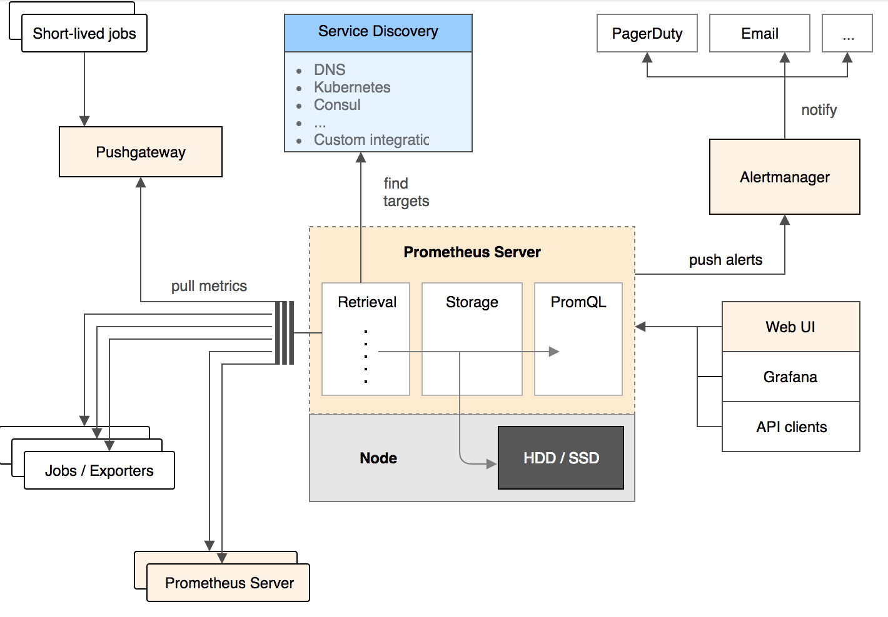

# Prometheus

## 什么是 Prometheus

> Prometheus /prəˈmiː.θi.əs/



- 一个**带时序数据库（TSDB）** 的**监控系统**。
- 通过**拉取（pull）方式收集测量数据**，并将其保存在TSDB 中。
- 提供**计量数据查询功能**，实现了类似于 SQL 的查询语法PromSQL。
- 提供**告警功能**，能根据已定义的告警规则向外输出告警。
- 虽然它自己实现了一个面板，但还比较简陋。现在主流的做法是将它**和 Grafana 结合**，由 Grafana 提供面板。

### 它不是什么

- 它不处理日志或跟踪（tracing），只处理计量数据。
- 它本身不是专门的具有良好扩展性的持久存储。它自身的存储，被设计为用于**短时间保存数据**。

## Prometheus 配置文件

```yaml
# 1. 全局配置段
global:
  # 采集间隔
  scrape_interval: 15s # Set the scrape interval to every 15 seconds. Default is every 1 minute.
  # 计算报警和预聚合间隔
  evaluation_interval: 15s # Evaluate rules every 15 seconds. The default is every 1 minute.
  # 采集超时时间
  scrape_timeout: 10s
  # 查询日志，包含各阶段耗时统计
  query_log_file: /opt/logs/prometheus_query_log
  # 全局标签组
  # 通过本实例采集的数据都会叠加下面的标签
  external_labels:
    account: "huawei-main"
    region: "beijng-01"
# 2. Alertmanager信息段
alerting:
  alertmanagers:
    - scheme: http
      static_configs:
        - targets:
        - "localhost:9093"
# 3. 告警、预聚合配置文件段
rule_files:
  - /etc/prometheus/rules/record.yml
  - /etc/prometheus/rules/alert.yml
# 4. 采集配置段
scrape_configs:
  # The job name is added as a label `job=<job_name>` to any timeseries scraped from this config.
  - job_name: "prometheus"
    # metrics_path defaults to '/metrics'
    # scheme defaults to 'http'.
    static_configs:
      - targets: ["localhost:9090"]
# 5. 远程查询段
remote_read:
  # prometheus
  - url: http://prometheus/v1/read
    read_recent: true
  # m3db
  - url: "http://m3coordinator-read:7201/api/v1/prom/remote/read"
    read_recent: true
# 6. 远程写入段
remote_write:
  - url: "http://m3coordinator-write:7201/api/v1/prom/remote/write"
    queue_config:
    capacity: 10000
    max_samples_per_send: 60000
    write_relabel_configs:
      - source_labels: [__name__]
        separator: ;
        # 标签key前缀匹配到的drop
        regex: "(kubelet_|apiserver_|container_fs_).*"
        replacement: $1
        action: drop
```

### Prometheus实例用途

| 对应的配置段                                     | 用途                                                        |
| ------------------------------------------------ | ----------------------------------------------------------- |
| 采集配置段                                       | 做采集器，数据保存在本地                                    |
| 采集配置段 + 远程写入段                          | 做采集器 + 传输器，数据保存在本地 + 远端存储                |
| 远程查询段                                       | 做查询器，查询远端存储数据                                  |
| 采集配置段 + 远程查询段                          | 做采集器+查询器，查询本地数据+远端存储数据                  |
| 采集配置段 + Alertmanager信息段 + 告警配置文件段 | 做采集器 + 告警触发器，查询本地数据生成报警发往Alertmanager |
| 远程查询段 + Alertmanager信息段 + 告警配置文件段 | 做远程告警触发器，查询远端数据生成报警发往Alertmanager      |
| 远程查询段 + 远程写入段  + 预聚合配置文件段      | 做预聚合指标，生成的结果集指标写入远端存储                  |

### Prometheus 配置文件各个大配置段

- **scrape_configs** 采集配置段做采集器
- **rule_files** 告警、预聚合配置文件段
- **remote_read** 远程查询段
- **remote_write** 远程写入段
- **alerting**: Alertmanager信息段

### 高频命令行参数

- `web.listen-address="0.0.0.0:8080"`
  - 监听地址
  - 多个 Prometheus 实例在一起时会争抢
- `storage.tsdb.path="data/"`
  - 本地 tsdb 存储位置
- `storage.tsdb.retention.time`
  - 数据保留时间，默认 15 天
- `web.enable-lifecycle`
  - 开启热更新配置
  - 使用 HTTP API 更新

## 基本概念

### Point

- 时序中单一数据点的数据结构
  - 大小 `16 bytes = 8 + 8`
- 标签与标签组 `key-value` 的字符串
- sample 时序曲线中的一点

## Prometheus 四种查询类型

### 1 . vector

- **Range vector**。一组时间序列，每个时间序列包含一个样本，所有样本共享相同的时间戳

### 2 . matrix

### 3 . scalar

### 4 . string

## Prometheus 四种标签匹配模式

### 1 `=` 等于

### 2 `！=` 不等于

### 3 `=~` 正则

### 2 `！~` 正则非匹配

## Promql

- topk、bottomk
- absent nodata 警报
- offset 同环比
- histogram_quantile 分位值
- 成功率 (成功/总数)
- agg_over_time 横向的聚合

**agg 去掉/保留 label，分布情况：**

- 去掉举例：``sum without(code) (rate(prometheus_http_requests_total[2m] ) )``
- 保留举例：``sum by(code) (rate(prometheus_http_requests_total[2m] ) )``

**topk bottomK 看top：**

- 举例：查看容器cpu使用率top5``topk(5,prometheus_http_response_size_bytes_bucket)``

- 最小的 bottomk(5,prometheus_http_response_size_bytes_bucket)

**同环比 相减：**

- 举例：qps环比1小时 掉10``sum (rate(prometheus_http_requests_total[2m] offset 1h) ) - sum (rate(prometheus_http_requests_total[2m] ) )``

**absent nodata报警：**

- ==1代表absent生效

- 举例：``absent(abc_def)==1``

**分位值histogram_quantile：**

- 举例查看apiserver 请求延迟90分位``histogram_quantile(0.90, sum(rate(prometheus_http_request_duration_seconds_bucket[5m])) by (le))``

**两组series关联  成功率百分比：**

- 举例：apiserver 请求成功率``100*( sum(prometheus_http_requests_total{code=~"2.*|3.*"})/  sum(prometheus_http_requests_total) )``

**agg_over_time 给所有ts的value做agg 横向agg：**

- 举例查看一天的alert``avg_over_time(go_goroutines [24h])``

## Exporters

- 广义上向 Prometheus **提供监控数据**的程序都可以成为一个 Exporter 的，一个 Exporter 的实例称为 target

### Node Exporter

#### 采集主机运行指标

- 能够采集到主机的运行指标如 CPU, 内存，磁盘等信息

#### 二次开发

1. `collector/` 目录下新建实现了 `Collector` 接口的自定义结构体
2. 创建 `Collector` 工厂函数
3. 在 `init` 函数注册 `Collector`
4. 编译发布

### Blackbox Exporter

#### 网络监控

- Prometheus 社区提供的官方黑盒监控解决方案,其允许用户通过: `HTTP\HTTPS\DNS\TCP\ICMP` 的方式对网络进行探测.

### Mysql Exporter

#### Mysql监控

#### 修改 mysqld_exporter 源码，改造成类似 blackbox 的探针型，实现一对多探测

##### 为何官方要求设计成一对一的模型

- 主要是云原生环境下，一对一可以以 sidecar 模式部署
- 但是 mysqld 一般不运行在 k8s中

#### 改造方案

1. 首先注释掉代码中 dsn 的检查限制
2. 添加 `http.HandleFunc` 以 http 传参 dsn，变成一个 blackbox_exporter 形式的探针

##### 总结

- 只能一对一，不能像探针一样采集多个实例
- dsn 需要配置环境变量或者配置文件解析
- 需求说明改造成类似 blackbox 的探针型，实现一对多探测

### Process Exporter

#### 采集进程运行指标

- 读取 `/proc` 类容

### Redis Exporter

#### Redis 监控

### JMX Exporter

#### JVM 监控

- kafka
- zookeeper

## Pushgateway

- [Pushgateway](https://prometheus.io/docs/practices/pushing/) 的唯一有效用例是捕获服务级别批处理作业的结果
- pull 网络不通，但有[替代方案](https://github.com/prometheus-community/PushProx)

## Alertmanager

- [文档](https://prometheus.io/docs/alerting/latest/alertmanager/)
- Alertmanager 处理由诸如 Prometheus 服务器之类的客户端应用程序发送的警报

### Alertmanager 核心功能点

1. deduplicating
    - Prometheus 产生同一条报警发送给多个 alm 去重后发送
2. grouping
    - 告警可以分组处理，同一个组里共享等待时长等参数可以做告警聚合
3. route
    - 路由匹配树，可以理解为告警订阅
4. silencing
    - 灵活的告警静默，如按 tag
5. inhibition
    - 如果某些其他警报已经触发，则抑制某些警报的通知
    - 如机器 down，上面的进程 down 告警不触发
6. HA
    - gossip 实现

## Kubernetes 监控

### Kuberneters 监控所面临的挑战

#### 1 监控的目标**种类多**

- Pod
- Node
- Service
- Endpoint
- PV
- PVC
- Job
- Cronjob

#### 2 监控的目标**数量多**

#### 3 对象的**变更和扩缩**特别**频繁**

#### 4 监控对象**访问权限**问题

### Kubernetes 中关注四大块指标总结

#### 1 容器基础资源指标

- [kube-stats-metrics](https://github.com/kubernetes/kube-state-metrics)

#### 2 资源指标

#### 3 服务组件指标

#### 4 部署在pod中业务埋点指标

## Grafana

/ˈɡrɑːfɑːnɑː/

[大盘模板](https://grafana.com/grafana/dashboards)

**大盘模板查看指标：**

- Node-Exporter
  - [13105]( https://grafana.com/grafana/dashboards/13105 )

## Kubernetes

### Kubernetes 容器基础资源指标

- 容器采集流程追查
  - 通过容器的内存指标追踪 job 得知是 kubelet 进程
  - kubelet 进程内置了 [cadvisor](https://github.com/google/cadvisor) 的代码
  - 底层采集来自 cadvisor

### Pull 模型在 k8s 中的应用，对比 Push 模型

1. **扩展性**，就采集器是否丰富来说
    - 我们需要对比的是这个系统是否有很好的插件扩展机制，因为这直接决定了开源社区对该系统采集器贡献的活跃度
    - Prometheus 采集的 Pull 模型，使用者可以用自定义 exporter 的模式灵活的接入
2. **解耦**，Push 型的致命缺点 Agent 和服务端强耦合
    - 那就是 Agent 需要配置服务端地址，带来了一定的耦合性，不适合云原生场景
    - 如果采用 Push 型，在启动的时候需要指定监控上报的服务地址，那是不能接受的。
    - 类比 Pushgateway 的例子 `pusher = push.New(url, jobName)` 必须要指定服务端的地址
3. **稳定性**，如果 push 端的服务地址变化了怎么办
    - 一个典型的场景就是在 k8s 中，pod 的扩缩十分频繁，服务端的地址也不固定
4. **自动发现**，Pull 型的处理方法
    - 对比来说，应用 Pull 模型采集的 prometheus，可以对接多种服务发现源，特别适合 k8s 环境
    - 举个例子，应用的 pod 一旦发生变化，prometheus 就可以通过配置好 k8s 的服务发现模式监听到资源变化，进行采集的增删，agent 侧只需要暴露自己的指标，完全不关心是哪一个 server 过来获取数据

### Kubernetes 中关注四大块指标

| 指标类型                  | 采集源                                                                            | 应用举例                                                                                    | 发现类型                                    |
| ------------------------- | --------------------------------------------------------------------------------- | ------------------------------------------------------------------------------------------- | ------------------------------------------- |
| 容器基础资源指标          | kubelet 内置 cadvisor metrics 接口                                                | 查看容器 cpu、mem 利用率等                                                                  | k8s_sd node 级别直接访问 node_ip            |
| k8s 对象资源指标          | [kube-stats-metrics](https://github.com/kubernetes/kube-state-metrics) (简称 ksm) | 具体可以看看 pod 状态如 pod waiting 状态的原因数个数如：查看 node pod 按 namespace 分布情况 | 通过 coredns 访问域名                       |
| k8s 服务组件指标          | 服务组件 metrics 接口                                                             | 查看 apiserver 、scheduler、etc、coredns 请求延迟等                                         | k8s_sd endpoint 级别                        |
| 部署在 pod 中业务埋点指标 | pod 的 metrics 接口                                                               | 依据业务指标场景                                                                            | k8s_sd pod 级别，访问 pod ip 的 metricspath |

### 为 k8s 监控做的适配工作

| 适配名字                | 说明                                                                        | 举例                                                                     |
| :---------------------- | :-------------------------------------------------------------------------- | :----------------------------------------------------------------------- |
| 各个组件 metrics 自暴露 | 所有组件将自身指标暴露在各自的服务端口上，prometheus 通过 pull 过来拉取指标 | apiserver: 6443/metrics                                                  |
| k8s 服务发现            | 通过 watch 即时发现资源变化                                                 | `kubernetes_sd_configs:- role: node`                                     |
| 鉴权                    | k8s 的组件接口都是要鉴权的，所以 k8s 的采集器要支持配置鉴权                 | 支持配置 token 和 tls 证书                                               |
| 标签 relabel 能力       | 过滤服务发现标的                                                            | `labelmap` 去掉服务发现标签的长前缀`replace` 做替换 `hashmod` 做静态分片 |

### 强大的 relabel 能力在 k8s 中的应用

  1. labelmap 在采集 cadvisor 指标时对服务发现标签 key 名字截取
  2. 采集 pod 自定义指标中 replace 和 keep 的应用
  3. k8s 服务组件采集时的 endpoint 过滤
  4. hashmod 解决 k8s 大集群采集问题
  5. drop 去掉不想要采集的指标

## 技术

### 时序数据库 TSDB

- [LSM](../../Algorithm/LSM.md)
- [facebook Gorilla 压缩算法]( https://blog.acolyer.org/2016/05/03/gorilla-a-fast-scalable-in-memory-time-series-database/ )
  - DOD 压缩，压缩时序
  - XOR 压缩，压缩值

### 倒排索引

### mmap 的应用

- Prometheus 使用 `mmap` 读取**压缩合并后的大文件** (不占用太多句柄)，建立进程**虚拟地址**和**文件偏移**的**映射关系**，只有在查询读取对应的位置时才将数据真正读到物理内存
- **绕过**文件系统 `page cache`，减少了一次数据拷贝
- 查询结束后，对应内存由 Linux 系统根据内存压力情况自动进行回收，**在回收之前可用于下一次查询命中**
- 使用 mmap 自动管理查询所需的的内存缓存，具有管理简单，处理高效的优势。

## 高可用

### 低成本存储 multi_remote_read 方案

就可以用多个采集的 Prometheus + 多个无状态的 Prometheus Query 实现 Prometheus 的高可用方案

- 监控数据存储在多个采集器的本地，可以是机器上的prometheus
- 也可以是 k8s 中的 prometheus statefulset
- prometheus query remote_read 填写多个 `prometheus/api/v1/read/` 地址

#### 数据重复怎么办

- query 会做 merge，多个数据只会保留一份
- 可以利用这个特点模拟副本机制：
  - 重要的采集 job 由两个以上的采集 prometheus 采集
  - 查询的时候 merge 数据
  - 可以避免其中一个挂掉时没数据的问题

#### multi_remote_read 方案缺点

- 并发查询必须要等最慢的那个返回才返回，有某个慢的节点会导致查询速度下降
- 应对重查询时可能会把query打挂
  - 但也正是这个特点，会很好的保护后端存储分片
  - 重查询的基数分散给多个采集器了
- 由于是无差别的并发 query，也就是说所有的 query 都会打向所有的采集器，会导致一些采集器总是查询不存在他这里的数据 (m3db 有布隆过滤器来防止这个问题)

#### m3db

通过 remote_read 整合

#### Thanos

- 核心优点
  - 无需维护存储，存储高可用： 利用廉价的公有云对象存储，高可用
  - 长时间存储，数据降采样：利用 Compactor 降采样
  - 完全适配原生 prometheus 查询接口：Query 实现
  - 多级数据缓存配置

## kube-prometheus

> Pod
>     Container

- quay.io/brancz/kube-rbac-proxy (用于权限控制，访问 kube-state-metrics 的 sidecar 容器)
- alertmanager-main
    - quay.io/prometheus/alertmanager (alertmanager)
    - quay.io/prometheus-operator/prometheus-config-reloader (配置热加载)
- blackbox-exporter:	
    - quay.io/prometheus/blackbox-exporter (网络监控信息采集器)
    - jimmidyson/configmap-reload (配置热加载)
    - quay.io/brancz/kube-rbac-proxy
- grafana
    - grafana/grafana (仪表盘)
- kube-state-metrics
    - registry.k8s.io/kube-state-metrics/kube-state-metrics (收集 k8s 集群数据，由于安全性问题，只暴露 127.0.0.1 IP 服务，需要通过 kube-rbac-proxy 访问)
    - quay.io/brancz/kube-rbac-proxy × 2
- node-exporter
    - quay.io/prometheus/node-exporter (节点监控信息采集器)
    - quay.io/brancz/kube-rbac-proxy 
- prometheus-adapter
    - registry.k8s.io/prometheus-adapter/prometheus-adapter (帮我们使用 Prometheus 收集的指标并使用它们来制定扩展策略)
- prometheus-k8s
    - quay.io/prometheus/prometheus (Prometheus Server)
    - quay.io/prometheus-operator/prometheus-config-reloader (配置热加载)
- prometheus-operator
    - quay.io/prometheus-operator/prometheus-operator
    - quay.io/brancz/kube-rbac-proxy

### kube-prometheus 中的 grafana 总结

- db 使用 sqlit，volume 类型为 emptydir 无法持久化，pod 扩缩就重新创建
- 通过 configMap 设置的 prometheus DataSource
  - 通过 prometheus-k8s svc 对应的域名访问
  - 下面对应两个 prometheus 容器，有 HA
- 各个 dashboard 通过 configMap 挂载，grafana 动态加载，不能修改
- 内置了22张大盘图，包含预聚合指标，很全面

## 预聚合提速实战项目之需求分析和架构设计

## 配置 alertmanager 高可用并测试

- [Gossoip](../../Algorithm/Gossoip.md)协议

## 告警自愈之回调重启服务实战