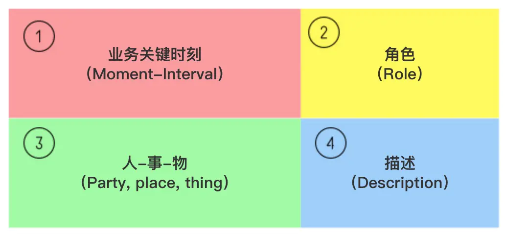
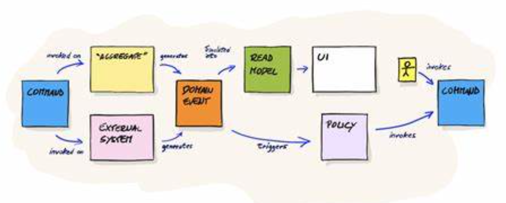

# 领域驱动设计 (Domain-Driven Design)

[TOC]

## 什么是 DDD

* 领域驱动设计 (Domain-Driven Design)
* 它主要可以帮助我们 **解决** 传统单体式集中架构 **难以快速响应业务需求落地** 的问题，并且针对中台和微服务盛行的场景做出指导。
* DDD 为我们 **提供架构设计的方法论**，**既面向技术也面向业务**，从业务的角度来把握设计方案。

### DDD 作用

* **统一思想**：统一项目各方业务、产品、开发对问题的认知，而不是开发和产品统一，业务又和产品统一从而产生分歧。
* **明确分工**：域模型需要明确定义来解决方方面面的问题，而针对这些问题则形成了团队分钟的理解。
* **反映变化**：需求是不断变化的，因此我们的模型也是在不断的变化的。领域模型则可以真实的反映这些变化。
* **边界分离**：领域模型与数据模型分离，用领域模型来界定哪些需求在什么地方实现，保持结构清晰。

### 领域驱动设计

* 定义 **领域模型**
* 确定 **业务边界**
  * 业务角度
  * **战略设计** (高级开发人员进行设计)
* 确定 **技术边界**
  * 技术角度
  * 技术实现
  * **战术设计** (业务开发人员)  

### 项目设计流程

1. 范围定义
   * **概念设计** *(架构师、产品、运营)*
     * 概念关联图
     * 概念类
     * 领域类图
     * 填充属性
   * **逻辑设计** *(技术专家、高级开发)*
     * 业务逻辑
     * 业务模型
   * **物理设计** *(所有开发人员)*
     * 可能会推翻原有设计
     * 定义架构风格 (微服务...)
     * 数据存储问题
       * 索引
       * 视图
       * 分区
2. 问题分析
3. 需求分析
4. 逻辑设计
5. 决策分析

### 领域驱动设计要求

1. 项目中对架构师技术要求特别高，需要对业务熟悉。
2. 其他角色技术要求也要特别高。

## 领域模型

* 领域模型是对 **领域内** 的 **概念类** 或 **现实世界中对象** 的 **可视化表示**。

### 业务对象模型

* **业务对象** 之间的引用关系
* 业务逻辑流转的过程中需要的所有角色，甚至包括你的业务逻辑流转本身

#### 业务对象

* **业务角色** 表示一个 **角色** 以及其所 **承担的一系列责任** (收银员 - 职责：收钱、找零、退换货)
* **业务实体** 与业务角色 **交互** 所需要的 **可交付的工件、资源、事件** (电商项目：商品)
* **业务用例** 业务角色与业务实体之间 **如何执行工作流程** (业务链路、测试用例)

#### 对象行为

* **固有行为**。 一般行为，如吃饭、睡觉等
* **非固有行为**。 特殊行为，如划水、跳伞

#### 四种模型

##### 失血模型

* 老旧项目
* 特点
  1. 对象中只包含 `get` 、 `set` 方法 (POJO)
  2. 业务逻辑层 (service)
     * 包含了 **业务逻辑** 以及 **持久层** 的交互
* 优点
  * 领域对象 **结构简单**
* 缺点
  * 肿胀的业务代码逻辑，**难以维护**
  * 无法应对 **频繁更改的需求**

##### 贫血模型 (Anemic Domain Model)

* 最常用
* 特点
  1. 对象中包含：属性、固有行为
  2. 业务逻辑层 (service)：非固有行为
  3. 持久层 (DAO)
* 优点
  * 层次结构清楚，各层级是单向依赖 (对于只有少量业务逻辑的应用来说，使用起来非常自然)
  * 开发非常迅速，易于理解
* 缺点
  * 无法良好的应对非常复杂的逻辑以及场景

##### 充血模型 (Rich Domain Model)

* 特点
  1. 对象中包含：固有行为、非固有行为
  2. 业务逻辑层 (service)：整合、事务封装
* 优点
  * 更符合 **面向对象** 原则
  * 业务逻辑层很薄，符合单一职责原则
* 缺点
  * 落地困难
  * **职责** 不好划分，要求开发者水平要很高
  * 模型包含大量操作，**增加不必要的消耗**
* 业务领域：保险、人寿

##### 胀血模型

* 特点
  1. 对象中包含：固有行为、非固有行为、事务、授权
  2. 持久层 (DAO)
* 优点
  * 简化了分层架构
  * 符合面向对象设计原则
* 缺点
  * 取消了业务逻辑层，直接在领域对象上封装事务以及授权，授权很多原本不属于这个领域对象的逻辑，模型不稳定
  * 代码稳定性、维护的稳定性

## DDD 分层架构设计

### 作用

* 达到高内聚
* 低耦合
* 复用性设计
* 扩展性设计

### 分层架构

#### 严格分层架构

* 某层只能与位于其直接下方的层发生耦合

#### 松散分层架构

* 则允许某层与它的任意下方层发生耦合

### 三层架构

* 松散分层架构

#### 三层架构设计

* MVC
  * 缺点
    * 导致 **控制器冗余**
    * 控制器对于 **对象依赖过重**
    * 对象之间会产生 **耦合**
    * 由于 `Spring` 的存在，开发 **不符合面向对象** 的
  * 本质上与 DDD 有冲突点。DDD 更重视角色的交互。

### 四层架构

* 松散分层架构

#### 四层架构设计

1. 用户界面层 (User Interface)
   * 显示信息给用户
   * 对外的 model
   * 模型转换
2. 应用层 (Application)
   * 线程调度
   * 应用服务
   * 与模型进行与实体无关的业务逻辑
3. 领域层 (Domain)
   * 业务概念
   * 规则
   * 领域模型
4. 基础实施层 (Infrastructure)
   * 交互层次

### 五层架构

* 松散分层架构

#### 面向对象建模所面临的问题

* 数据边界与行为边界不一致
  1. 跨越多个子域
     * 在当前的领域聚合，如中台
     * 哑数据对象，贫血模型
     * 适合项目快速迭代的，开发人员不足
  2. 充血模型带来的复杂度
     * 适合项目组水平比较高、业务熟悉的情况
* 领域对象高内聚、低耦合问题

#### DCI

* 对MVC架构的补充，面向对象量化落地
* 与 DDD 契合，用在基于面向对象的领域建模上
* **Data** 对象数据
* **Context** 对象的场景
* **InterActions** 交互行为

#### 五层架构设计

1. 用户界面层 (User Interface)
2. 应用层 (Application)
3. 环境层 (Context)
   * 领域与行为绑定，聚合
4. 领域层 (Domain)
5. 基础实施层 (Infrastructure)

#### 五层架构变体

1. 用户界面层 (User Interface)
2. 调度层 (Scheduler)
   * 线程调度
3. 事务处理层 (Transaction)
   * 类级别、接口序列级别，的事务处理
4. 环境层 (Context)
5. 领域层 (Domain)
6. 基础实施层 (Infrastructure)

### 六边形架构

* 严格分层架构

#### 依赖倒置原则

* 高层模块不应该过于依赖底层模块，两者都应该依赖抽象
* 抽象不应该依赖于细节，细节应该依赖于抽象

#### 六边形架构模式的演变

* Jeffrey Palermo 在2008年提出了[洋葱架构](https://link.jianshu.com/?t=http%3A%2F%2Fjeffreypalermo.com%2Fblog%2Fthe-onion-architecture-part-1%2F)，六边形架构是洋葱架构的一个超集。

* Robert C. Martin在2012年提出了[干净架构 (Clean Architecture)](https://link.jianshu.com/?t=https%3A%2F%2F8thlight.com%2Fblog%2Funcle-bob%2F2012%2F08%2F13%2Fthe-clean-architecture.html)，这是六边形架构的一个变体。
* Russ Miles在2013年提出了[Life Preserver](https://link.jianshu.com/?t=https%3A%2F%2Fwww.infoq.com%2Fnews%2F2013%2F08%2Fhexagonal-lifepreserver-spring)设计，这是一种基于六边形架构的设计。

> *业务驱动技术进行衍生、发展*

## 战略设计

* 从**业务角度**出发，**建立业务模型**，**划分业务边界**
* 一种用高层次视野审视软件系统的方式

### 战略设计概念

#### 领域

* 一个领域本质上可以理解为就是一个 **问题域** 。只要是同一个领域，那 **问题域** 相同。

> 例如：传统电商领域的问题无非就是订单，商品，物流，支付，库存等等。绝对不会涉及到比如出行，政法等相关问题。社交电商除了会有传统的电商属性外，也会附带上社交，通讯相关的功能。

#### 子域

* 可以理解为更加细分的领域。甚至可以把子域进行更加的细分。分成 ([领域划分](30-领域划分.md)) 更多子域。

> 如果电商平台看成一个领域，那么订单，仓储，物流，都可以是子域，而仓储可以划分成本地仓储，三方仓库，异地仓储等等。这些都可以看成是子域。

##### 核心子域

* **核心域** 是整个业务系统的核心，所有的业务都要围绕着**核心业务域**展开。
* 如何明确你的业务核心呢？
  * 精炼业务域
    * 领域愿景说明 (Domain Vision Statement)
      * 项目目标
    * 突出核心 (Highlighted Core)
      * 由文档突出核心
    * 内聚机制 (Cohesive Mechanism)
      * 内聚核心，其余抽取出去
    * 分离的核心 (Segregated Core)
      * 调整业务边界，模型
    * 抽象核心 (Abstract Core)
      * 把模型最基本的概念分离到不同的类中

##### 通用子域

* **整个**领域**都能够用**到的**子域**

##### 支持子域

* 支撑域实际上就是**不包含核心竞争力的功能**，也**不包含通用的功能**，但是又**是必须的支撑**

#### 通用语言

#### 限界上下文

* [限界上下文](40-限界上下文.md)用来封装 *通用语言* 和 *领域对象* ，**提供上下文环境**，保证在领域内的一些术语、业务相关对象等 (通用语言) 有一个确切的含义，没有二义性。这个**边界定义了模型的适用范围**。

### 建模方法

#### UML 建模 (适合在小范围使用)

* 不推荐用在 DDD 当中，DDD 用于解决复杂问题。模型中 *关联关系* 、*引用关系* 错综复杂，建模难度大。

#### 四色建模法

[四色建模法](./ModelingMethods/ModelingInColor.md)

#### 限界纸笔法

#### 事件风暴

[EventStoriming](./ModelingMethods/EventStoriming.md)

### 频繁的进行战略改动

* 没有办法确定核心业务，不建议用领域驱动设计来建设项目。

## 战术设计

* 根据业务模型进行技术实现，完成软件得开发以及落地

### 战术设计概念

#### 实体

* 实体核心是用 **唯一的标识符** 来定义，而不是通过属性来定义。即使属性完全相同也可能是两个不同的对象。
* 实体本身 **有状态**
* 实体 **有演进的生命周期**
* 实体本身 **会体现出相关的业务行为**，业务行为 **会对实体属性或状态造成影响和改变**

#### 值对象

* 用于描述领域的某个方面本身 **没有概念标识的对象**，被实例化后只是 **提供值** 或叫 **设计元素**，只关心设计元素是什么，而不关心这些设计元素是谁
* 无状态
* 本身不产生行为
* 不存在生命周期演进
* 不会进行单独的持久化，对照数据库进行持久化

##### 值对象与实体的区别以及关联

* **实体 (Entity)**
  * 基础单元
  * 逻辑模型 <-> 物理模型
* **值对象 (Value Object)**
  * 可能是单一属性

#### 聚合以及聚合根

##### 聚合

* 将实体和值对象划分为聚合并围绕着聚合 **定义边界**
* 选择一个实体作为 **每个聚合的根** ，并仅允许 **外部对象** 持有对聚合根的引用
* 作为一个整体来定义聚合的 **属性和不变量** ，并把其 **执行责任** 赋予 **聚合根** 或指定的 **框架机制**

##### 聚合根

* **聚合根是实体** ，拥有实体的业务 **属性和行为**，同时也是 **聚合的管理者** ，负责 **协调** 聚合内的实体和值对象，按照固定的业务规则，完成业务逻辑
* 聚合根是聚合 **对外唯一的接口人** ，聚合之间以 **聚合根 ID 关联** 的方式接受聚合的外部任务和请求，聚合外不能通过对象引用的方式访问聚合内的对象。需要将关联的聚合根 ID 作为入参，先访问聚合根，再通过聚合根导航到聚合内部实体
* 如果聚合根被 **删除** 了，它引用的实体和值对象就不会存在了
* 聚合根和聚合根所在层的领域服务都可以组合多个实体完成领域逻辑，但为了 DDD 分层架构的职责单一，聚合根最好 **只承担聚合管理职能**，只实现聚合实体和聚合根本身相关的业务逻辑，而跨多个实体的复杂领域逻辑统一放到领域服务中实现

##### 聚合的边界划分设计原则

##### 4条原则

1. 生命周期一致原则
   * 内部的对象应该跟聚合根有相同的生命周期
2. 问题域一致性原则
3. 场景一致性原则
   * 操作频率一致性
4. 聚合尽可能小
   * 大聚合问题
     * 性能问题
     * 更容易受到并发的影响
     * 拓展性差

#### 领域服务

* 有些重要的领域操作，**不适合** 归到 *实体* 和 *值对象* 的夷别中，这些操作从本质上讲是有些活动或动作，而不是事物，当领域中的某个重要过程或转换操作**不属于实体或者值对象的自然职责**时，应该在模型中添加一个作为独立接口的操作，并将其中名为 **Service**

* 涉及到**跨越多个实体**的操作
  * 如内部转账，从一个账户实体到另一个账户实体
* 涉及到与**外部系统的交互**
  * 调用外部支付

##### ※ 确认领域服务的一些规则

1. 不能再领域层写太多业务逻辑
    * Q：是否必须要通过领域服务来操作实体？A：不一定
2. 不能在领域服务里面调用 `Dao` ，和仓储
    * Q：能否在领域服务中去调用 `Dao` 层？A：可以，但不推荐，保证领域服务是很薄的一层
3. 领域服务视为实体的一种补充，里面的属性和逻辑也和实体不一样，**不能是基础类型，得是含有业务含义的值对象**
4. 领域服务之间可以进行调用，最好是 **保持父域的领域服务调用子域的领域服务**，**不允许跨越上下文** 进行调用

#### 领域事件

* 领域专家所关心的 **发生在领域中的一些事件**。
* 将领域中所发生的活动**建模成一系列的离散事件**。每个事件都 **用领域对象来表示**。
* 领域事件是 **领域模型的组成部分**，表示领域中所发生的事情
* 优点
  * 解耦
* 缺点
  * 可读性差
  * 代码复杂度增加

#### 资源库/仓储

##### 仓储作用

* 封装
* 创建
* 持久化

##### 仓储原则

* 原则上，**一个聚合根只会需要一个仓储**，不需要给每个实体创建一个仓储
* 仓储方式最好**只有一个** `save` 和 `byId`

> **聚合与聚合根** 定义了 **业务边界**，结合了非常多的 **实体和值对象**。 *-- "内聚成核心结构"*

#### 工厂

* 包含 `create` 创建实体的方法

## 微服务架构

[微服务架构](10-微服务架构.md)

## 六个问题与六个步骤

[六个问题与六个步骤](15-六个问题与六个步骤.md)

## 建模与设计的流程

[建模与设计的流程](20-建模与设计的流程.md)
