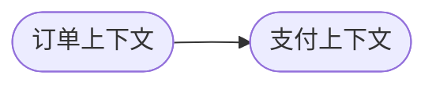
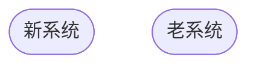

# 上下文映射

1. 上下文映射是指的**限界上下文之间的模型映射关系**
2. 团队之间的协作关系以及上下文之间的集成关系
3. 上下文映射决定了上下文之间**如何集成**以及**如何设置防腐层**

## 重复的上下文动作

## 上下文映射九大模式

### 1 合伙人

**要么一起成功，要么一起失败**，此时他们需要建立起一种合作关系。他们需要一起协调开发计划和集成管理。两个模块间可以互通有无，与技术无关

### 2 共享内核

1. 两个上下文**共享部分模型**，模型和代码的共享将产生一种紧密的**依赖性**
2. 共享部分**包括**但是**不限于 `代码`，`jar 包`，`数据库表` 以及一切可共享部分**

> 注意：谨慎使用，因为需要团队协作非常紧密，并且共享部分稳定

### 3 客户 / 供应商模式

客户方(D) 提需求，供应方(U) 配合做开发，现在用 `MQ` 解耦的方式就非常类似这种

这种情况一般指代**下游上下文向上游上下文提需求**，一般用于**核心域**与**非核心域**的协作

>U 方 Upstream 上游被依赖方
>D 方 Downstream 下游依赖方

### 4 顺从者模式 / 尊奉者

在**存在上游-下游关系**时，如果 *上游团队* 已经**没有动力提供** *下游团队* 之所需，下游团队便孤军无助了。只能盲目地使用上游团队的模型。所以这种方式适用于**没有模型到模型的转换**，属于**其他下游上下文沿用上游上下文的部分模型**

### 5 防腐层模式

1. **承接上下游模型**的一种模式
2. 将上游的上下文模型**转换成自己的上下文模型**
3. 同时属于下游上下文**访问外部模型的代理层**。

### 6 分道扬镳模式 / 另谋他路

* 两个系统**没有任何协作的可能性**，各自独立
* 或者**集成成本过高**

### 7 开放主机服务模式

服务提供方为所有消费方**提供一套公共的 API**，针对**所有的通用模型以及通用功能**

### 8 公共语言模式

* **标准化**和**协议化**的模型
* 所有上下文都可以**跟公共语言中的模型进行转换**
* 对接了公开语言的上下文之间**可以实现组件化对接**

>如：
    蓝牙协议、TCP/IP
    Java 的 JDBC，JVM 标准
    SQL

### 9 大泥球模式

* 由**复杂模式**的模型构成的糟糕的系统，模型**不稳定且难以维护**
* 与大泥球的合作一定要切记自身不被**污染**，设计**防腐层**

## 上下文映射图

