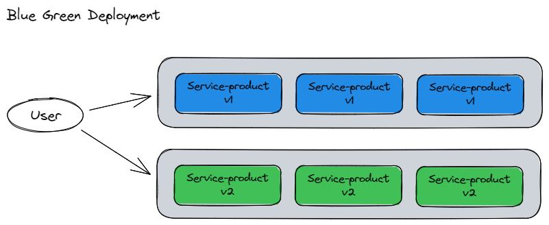
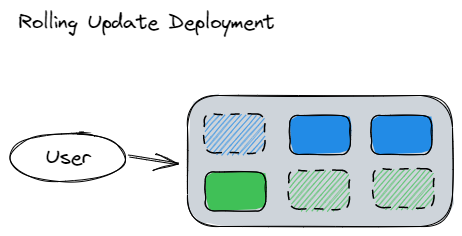
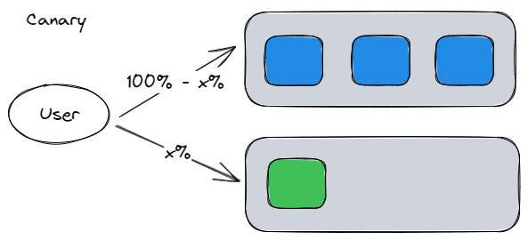
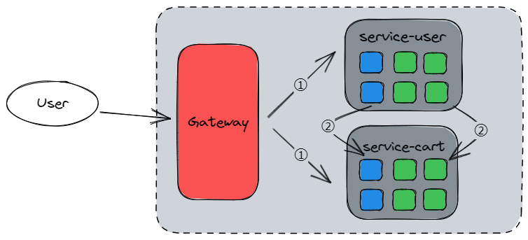

# Deployment

## 蓝绿发布

- 缺点：
  - 需要多部署一套系统 (PreProduction)，浪费资源
  - 影响范围大

## 滚动发布

- 优点：
  - 节约服务器资源
  - K8s 原生支持
- 缺点：
  - 无法实现 A/B Testing

## 灰度发布/金丝雀发布

## 负载均衡

## 小结

综上所述，三种方式均可以做到**平滑式升级**，在升级过程中服务仍然保持服务的**连续性**，升级对外界是**无感知**的。那生产上选择哪种部署方法最合适呢？这取决于哪种方法最适合你的业务和技术需求。如果你们运维自动化能力储备不够，肯定是越简单越好，建议蓝绿发布，如果业务对用户依赖很强，建议灰度发布。如果是K8S平台，滚动更新是现成的方案，建议先直接使用。

- 蓝绿发布：两套环境交替升级，旧版本保留一定时间便于回滚。
- 灰度发布：根据比例将老版本升级，例如80%用户访问是老版本，20%用户访问是新版本。
- 滚动发布：按批次停止老版本实例，启动新版本实例。
