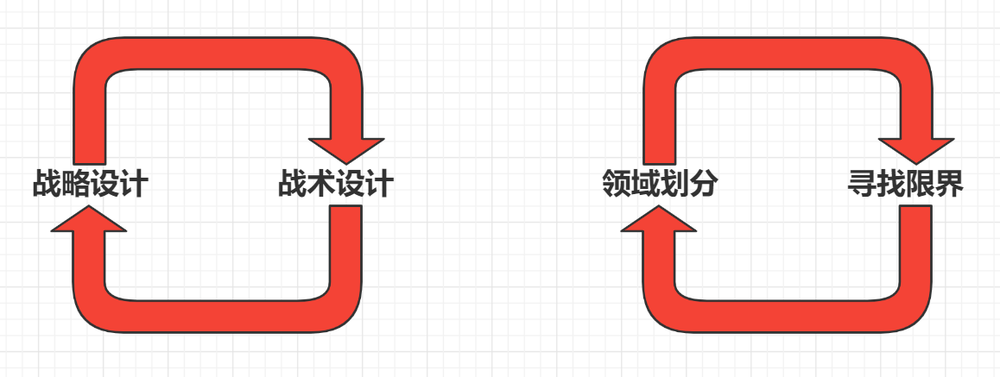
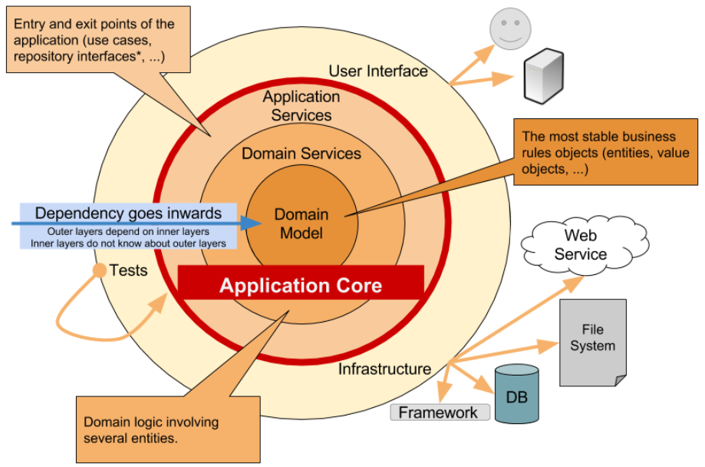
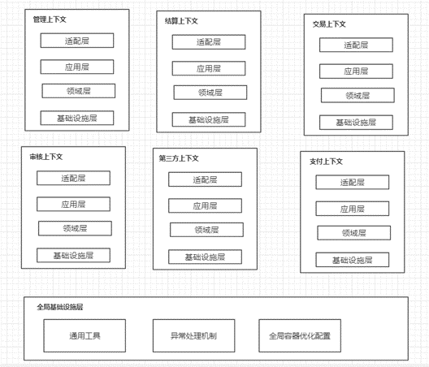

# 建模与设计的流程

建模与设计的流程实际上分为4个部分，分别是挖掘用户故事，确定核心愿景，建立通用语言，战略设计，战术设计。其实这四个步骤是脱离于原本的领域驱动设计的思想的，因为原本的领域驱动设计是在战略设计当中进行 1，2 步操作的，但是由于实际情况的不同，我们很难直接去进行战略设计，所以会将**挖掘用户故事，确定核心愿景**，放在立项初衷，因为一般这个步骤是由老板确定的，或者核心产品负责人确定，与技术无关性较大，而**通用语言的建立也是立项之初就应该确定的事情**。

**软件生命周期：**

1. 市场调研
2. 需求分析
3. 立项
4. 竞品分析
5. 技术方案架构

由于项目的**需求变更**，市场的变化，我们经常会需要改变原本的计划，比如可能进行到项目的战术设计阶段，由于一些原本没有考虑到的点，会导致我们回过头来对原本战略设计的模型进行优化，产生**设计涡流**，而建模过程中产生的设计涡流，则被叫做**建模涡流**。

## 1 挖掘用户故事，确定核心愿景

### 1.1 用户故事核心要素

#### 1.1.1 问题空间的描绘

* **`问题空间 = 问题域 = 领域 = 业务边界`**
* 一个**领域**代表了一个**问题域的边界**，也可以理解为是一个**业务的边界**。也就是说它是用来解决我们的**业务**开发能力的。
* 领域既然是一个边界，所以可以划分领域的大小，即领域划分，划分出来的子领域简称子域，**每个子域对应一个小的问题域和和小的业务**；不同的子域的重要不同，又可以分为核心子域、通用子域、支撑子域。

##### 1.1.2 文字表达

尽可能**表达用户需求**

##### 1.1.3  讨论 + 图形表达

不确定的东西，尽可能让研发，产品，运营等相关人员进行讨论，但是不是无意义的讨论，**需要用图形将讨论的东西固化下来**。

**反例：**

* **问题**：研发经常抱怨产品经理产品**需求不明确**，导致后续研发出现问题。比如：让用户能够便捷的注册，并且能够审核信息。这样的需求做出来的东西肯定是千奇百怪的。
* **解决**：正确的解决问题，**描述清楚用户的核心需求**。比如用户**必要的步骤**，核心的需求。比如用户需要填写哪些信息，**尽可能明确**，并且产品经理也需要**考虑到后续的改动**，比如后续可能会增加哪些字段，需不需要预先留位置。

> **一成不变的产品对于市场是没有吸引力的**。而没有性能上限的项目也是不存在的。所以本身开发人员跟市场变化就是一个对立面或者反向对标。而架构师其实算是技术领头人，所以架构要做的事情就是**尽可能消磨掉这种矛盾**。把问题从项目维度**降低到某个领域，某个能力**。比如从整体金融项目，降低到支付模块。这样开发人员的关注面就会变短。那么开发人员所处理的问题的复杂度也会降低。

### 1.2 由用户故事可能会引发的问题

* 代码**写好之后修改需求**
* **需求文档不细致**，**关键点不明确**，出现矛盾点的时候**产品也给不出答案**
* 产品**拍脑袋定需求**，**不考虑实际情况**

**解决问题的手段:**

* **围绕用户故事进行讨论**，**根据**讨论的图形以及文字**结果**，产品**进行**相应的**设计**
* 产品的交互设计，开发的程序逻辑包括表结构设计

#### 1.2.1 开发过程中用户故事的 3W 要素以及 3C 原则

##### 1.2.1.1 3W要素

用户故事 = 用户 + 故事 = 人 + 故 + 事
从需求角度描述就是一个用来确认用户和用户需求的简短描述。

一个完整的用户故事包含三个要素：

* 角色（who）：谁要使用这个
* 原因（why）：为什么要做这个活动  
* 活动（what）：要完成什么样活动

> 价值（value）：为什么要这么做，这么做能带来什么价值

##### 1.2.1.2 3C原则

用户故事的构建一般来说有三个环节：

1. 简单描述用户需求
2. 围绕简单描述进行讨论
3. 明确如何验证

分别对应用户故事的三个元素：

1. 卡片（Card）：用户故事一般在小卡片上写着故事的**简短描述**，**规则**和**完成标准** (3W)。
2. 交谈（Conversation）：用户故事背后的细节来源于和客户或者产品负责人的交流沟通；确保各方对故事的理解正确。并且最好**用相关的东西进行记录**，比如**图形**或者**文字**，**记录交谈的内容**。而我们**通用语言的确定**，很大程度也来自于我们的交谈话术。  
3. 确认（Confirmation）：通过**验收测试**确认用户故事**被正确完成**。

#### 1.2.2 INVEST原则

好的用户故事除了格式规范，要素完整外，还应该遵循 INVEST 原则。

##### 1.2.2.1 Idependent（独立的）

要尽可能的让一个用户故事独立于其他的用户故事。用户故事间保持独立性不仅便于排列和调整优先级，使得发布和迭代计划更容易制定，便于独立地理解、跟踪、实现、测试以及频繁交付，也使得用户故事的大小估算所涉及的范围更清晰，从而估算偏差更小。

##### 1.2.2.2 Negotiable（可协商的）

一个用户故事的内容要是可以协商的，用户故事不是合同。一个用户故事只是对用户故事的一个简短的描述，不包括太多的细节；具体的细节在沟通阶段产出。一个用户故事带有了太多的细节，实际上限制了用户、团队的想法和沟通。

##### 1.2.2.3 Valuable（有价值的）

每个故事必须对客户具有价值（无论是用户、购买方还是公司内部角色）。用户故事对于最终的用户是有价值的，因此应该站在用户的角度去编写，描述的是一个一个的feature，而非一个一个的task。

这个特点促进团队的开发和测试成员由传统的指令式工作方式向自驱动的价值导向工作方式转变，使团队中的每个人知道自己每天做的工作价值。

##### 1.2.2.4 Estimatable（可评估）

计划会议里面一个很重要的环节，那就是故事点的估计。实际上就是对要开发的User Story进行一个粗量级的估算，以便于团队能够知道这个user story的复杂度（工作量）。

重点放在当前迭代里能否按照该用户故事的接收条件和团队定义的DoD(完成标准)来完成这个用户故事，如果不能完成，给出理由，由PO来决定是否拆分或者重新设计用户故事。

让开发者难以估计故事的问题来自：对于领域知识的缺乏（这种情况下需要更多的沟通），或者故事太大了（这时需要把故事切分成小些的）。

##### 1.2.2.5 Small（小的）

一个好的故事在工作量上要尽量短小，最好不要超过10个理想人/天的工作量,至少要确保的是在一个迭代中能够完成。用户故事越大，在安排计划，工作量估算等方面的风险就会越大。

##### 1.2.2.6 Testable（可测试的）

一个用户故事要是可以测试的，以便于确认它是可以完成的。如果一个用户故事不能够测试，那么你就无法知道它什么时候可以完成。一个不可测试的用户故事例子：软件应该是易于使用的。

#### 1.2.3 三个准则

##### 1.2.3.1 一个用户

**只包含一个用户**，因为多个用户常常有细微的差别。一般是典型的用户，常常有共同的某类需求。

##### 1.2.3.2 完整价值

**完整地交付一个客户价值**。一个完整的用户故事意味着这个故事完成后，用户可以达成一个明确的、有意义的目标。

##### 1.2.3.3 不依赖

依赖性的三种常见类型是：重叠、顺序和包含。

总体上来说，故事之间功能点相互重叠是需要避免的；顺序关系是现实存在，在多数情况下可以通过一些手段解决；包含关系对复杂系统是有帮助的，对**排定发布**和**迭代计划**的影响需要注意。

###### 1.2.3.3.1 重叠依赖

重叠依赖是带来最多困扰的依赖形式，特别是多个用户故事包含多个不同的重叠部分时，很难找到一组用户故事可以代表该最小可行产品的功能集合，该集合应该包含且仅包含一次需要的功能。

**解决方式：**

将重叠部分单独剥离出来做为独立的用户故事；合理拆分用户故事，并且将重叠部分只保留在一个最有内聚性的用户故事中；使用Scrum开发模式。

###### 1.2.3.3.2 顺序依赖

顺序依赖是指要使某用户故事完成，另外的一个或多个用户故事必须在它之前完成。顺序依赖通常是无害的，而且有一些方式可以减轻这种依赖。

从敏捷开发的角度，整个系统是从初始的最小可行产品逐步演化为强大的产品，后面的每一步是建立在前面的基础之上的。

但从另外的角度，不必要的顺序依赖使得排列和调整优先级变的比较困难，进而影响制定发布和迭代计划，也使得用户故事的大小估算更难以把握。

**解决方式：**

一个迭代内的用户故事尽量做到没有内在依赖；保持迭代之间只有单向依赖，在时间上只有后面迭代的故事对前面迭代故事的单向依赖（前向依赖）；剥离出核心依赖作为独立的故事，不要把有依赖和无依赖的需求混在一个故事里。

###### 1.2.3.3.3 包含依赖

包含依赖是指在组织用户故事时使用有层级的管理，比如常见的特性－故事两级管理，一个特性包含多个用户故事，这样就构成了特性对其属下故事的包含依赖。

**解决方式：**

用户故事一级用来做迭代计划，避免用特性一级做粗粒度迭代计划，特性一级可以用来做发布计划；特性一级同样可以进行拆分，直至拆分到最小市场化特性的程度，并将其包含的用户故事分别归到新拆分出的特性中去；遵从最小可行产品的理念，一个特性分多个用户故事多个迭代实现，每一个迭代可形成潜在可交付或者提供内部或外部反馈。

### 1.3 构建项目的用户故事

项目立项之后，要做的第一件事情，就是**梳理出最顶层的用户故事**。在团队中，撰写用户故事的一般是产品经理。产品经理梳理出来最主要的项层用户故事，迈开了**系统分析**和**建模**工作的第一步。

> 所有用户故事的详细描述，都是**建立通用语言的关键资料**，因此，需要将其收录进项目通用语言文档，方便回溯。

### 1.4 使用合适的方法论以及工具去分析用户故事（Domain Storytelling）

**什么是 Domain Storytelling？**

Domain Sorytelling 是一种领域分析建模方法，通过这种方法，产品和研发人员可以利用语言学习的相同原理建立或者学习一个领域的通用语言，并且建立领域模型。

**Domain storytelling 图和相关工具。**

在storytclimy过程中，一方 (通常是架构师) 聆听另一方 (通常是产品经理或者领域专家) 以主谓宾的句型 (谁做了什么) 讲述用户故事的流程，进行问答和讨论，并以图形的方式快速复述出来。

> **`domain-story-modeler工具官方链接`**：[https://github.com/WPS/domain-story-modeler](https://github.com/WPS/domain-story-modeler)

![[images/建模与设计的流程/domain-storytelling-modler.png]]

## 2 建立通用语言

* 一种描述模型并且基于模型的语言
* 让团队的成员都在一个维度上进行沟通
* 不仅仅是文档，代码中也会存在通用语言。

**通用语言：**
![[images/建模与设计的流程/通用语言.png]]

**通用语言的使用：**

1. 类跟操作的名称
2. 施加于模型之上的规则或者约束
3. 应用于领域的模式

## 3 战略设计

### 3.1 领域划分

**什么是领域划分?**

* 领域划分就是**分离你的关注点**，让原本整体的业务**以问题空间为维度进行拆分**，便于问题的解决。
* 子域就是领域中**某一类问题**以及他**相关联的问题**

比如：
资管平台账号绑定、审核个人资质、额度审批、上架标的物审核、投标、放款、单据、资管平台异常告警

  ![[images/建模与设计的流程/金融领域划分1.png]]

**领域划分与传统开发模式思维带来的弊病:**

1. **问题点与领域知识重叠**
        举例：投标跟放款实际上都会涉及到支付，那么这个时候我们的支付可以走同一套支付逻辑
2. **模型重叠**
        都涉及到支付域，但实际上确实两个人开发

### 如何进行领域划分呢？

[领域划分](30-领域划分)

## 4 战术设计

**项目名称：**

com.xxx.xxx

**项目包构建：**

manage模块（管理）
balance模块（结算）
business模块（交易）
auditing模块（审核）
payment模块（结算）
outside模块（第三方对接）

### 划分限界上下文

[限界上下文](40-限界上下文)

### 上下文映射

[上下文映射](50-上下文映射)

## 分层架构

### 洋葱架构

* 优点
  * **各层职责清晰**，提高了大型复杂项目的**可维护性**
  * 结合 DDD，使项目**以领域模型为主**
  * **没有外部依赖**，方便进行单元测试
* 缺点
  * 如果只是简单的 CRUD 应用使用六边形架构会加大复杂性，**拖慢项目进度**
  * 业务比较简单的话也会**加大复杂性**
  * 引入 DDD 的思想，**对技术人员的要求较高**

## 对象命名约定

| 对象含义     | 分层架构层级 | 业内命名                | 阿里规约             | 本项目命名           |
| ------------ | ------------ | ----------------------- | -------------------- | -------------------- |
| 视图层对象   | 接口适配层   | Vo                      | Vo                   | Vo                   |
| 数据传输对象 | 应用层       | DTO                     | DTO                  | DTO                  |
| 数据存储对象 | 基础设施层   | Po (Persistentt Object) | Do (Data Object)     | Do                   |
| 领域对象     | 领域层       | Do (Domain Object)      | BO (business Object) | 根据领域中的对象命名 |

## 定义全局工程结构图

## 定义局部工程结构图

