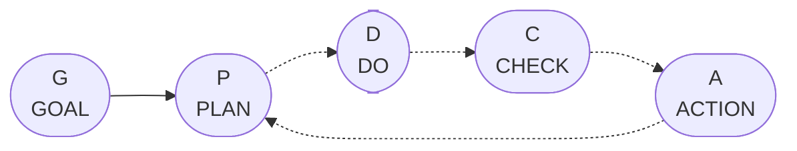
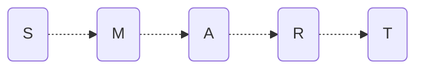
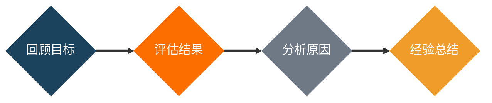
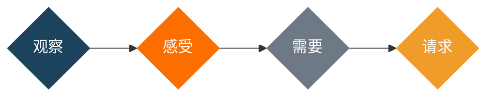
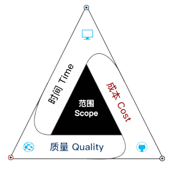
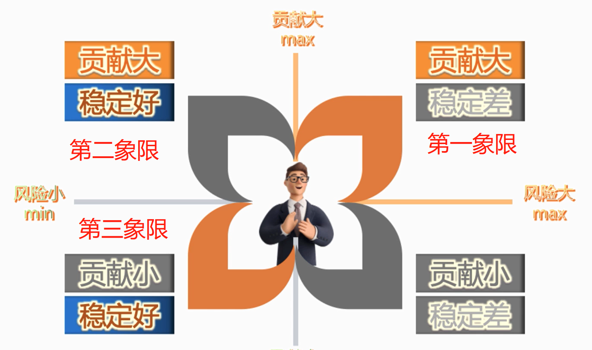

# 技术管理

## 方法论

1. 角色定位
   1. 员工
       1. [汇报方法](#102-汇报方法)
   2. 管理者
       1. [GROW](#112-grow-模型)
2. 计划执行
    1. [SMART Goals](#42-smart-goals)
    2. [PDCA 环](#41-pdca-cycle)
3. 学会授权
    1. [授权三段法](#63-工作授权三段法)
    2. [五步工作部署法](#64-五步工作部署法)
4. 训练能力
5. 协调能力
    1. [情绪沟通](#71-情绪沟通)
    2. [关键对话](#72-关键对话)
6. 自省能力
    1. [Retrospective-复盘](#43-retrospective)

## 1 什么是管理

### 1.1 管理的目的

- 在**有限的条件**下，如何通过**合理的组织和配置**人、财、物等因素，提高**生产力**的水平。
- 管理是从**资源**到**价值**的转化

### 1.2 管理的本质

- 管理是一种**实践**，其本质不在于**知**，而在于**行**，其验证不在于**逻辑**，而在于**成果**，其唯一的**权威性**就是成果

### 1.3 什么是管理

管理从根本意义上说解决的是**效率**的问题

1. 管
    1. 人
    2. 事
    3. 物
2. 理
    1. 目标
    2. 计划
    3. 沟通

## 2 管理者的思考方式

- 先**确立目标**以及**战略方向**，挖掘**用户故事**，确定**核心意愿**
- 是否**有结构化思维**
- 是否具**有强烈的目标导向意识**
- 是否具有**快速发现规律**和**预测结果**的能力 (应变能力)

## 3 如何完成角色转变？

> **飞轮效应：**
>
> 为了使静止的飞轮转动起来，一开始你必须花很大的力气反复的推。**达到某一临界点后**，飞轮的重力和冲力会合成为推动力的一部分。这时你无需再费更大的力气。飞轮依旧会快速转动，而且不停的转动。一旦体系能够彼此支撑，那么它的运作就会变得越来越容易。

### 3.1 学会合理的任务分配

- **分析任务**
- **拆解和整合任务**
- **优先级整理**

### 3.2 人的层面

- **注意新老搭配**
- **授权与监督**

## 4 目标、计划/考核、激励/辅导、反馈

### 4.1 PDCA Cycle

> 当我们面对人或者事的时候，一定要先设定一个够得着的目标，确定目标后完成**分析**、**拆解**、**整合**、**优先级排序**的动作，再之后就能制定出一个计划，而这个计划会按照 **"PDCA 环"** 去循环。



### 4.2 SMART Goals

> 无论面临什么样的问题，为你自己或者团队设置一个**明确**、**可量化**、**可达成**、**有相关性**、**有时限性**的目标，都会在很大程度上帮助你所解决面临的问题。



- **Specific**
  - 具体的，要用**具体的语言表达**你的诉求。
- **Measurable**
  - 可衡量的。你的目标应该要**有可以衡量的数据指标**作为达成依据。
- **Attainable**
  - 可实现的。你所设置目标的难易程度应当适中，**是一种你暂时达不到，但是跳一跳够得着的目标**。
- **Relevant**
  - 相关性的。你的**关键绩效指标应该与你的其它目标是相关联的**。
- **Time-bound**
  - 有明确期限的，**目标的时间限制**。

### 4.3 Retrospective

> **复盘**：最有用的方法论



- **回顾目标**
  - 有一个**明确的目标**很重要，因为要先有目标才能在后期回顾目标，来**判断是否达成了你想要的结果**。
- **评估结果**
  - 要针**对事**而不是针对人，**客观**看看待事情的**完成度**和**效果**。
- **分析原因**
  - 分析阻碍任务完成是**客观原因**还是**主观原因**，是**人为原因**还是**不可控的原因**。
- **总结经验**
  - 最简单的办法是，总结经验之后再去思考，如果这个任务**再来一遍**你能不能**完成得更好**。

## 5 如何处理技术与管理的关系

- 共创方式
- 从评估的角度去看待技术
- 从借助自己的技术到借助大家的技术

### 5.1 架构师需要的管理技能

1. 全局视野、规划能力
2. 结果导向的意识
3. 项目管理的方法
4. 沟通协调的能力

## 6 管理者的综合能力体现

### 6.1 综合能力组成

- 精通技术
- 有情商
- 能协调
- 成本分析
- 团队建设
- 会沟通
- 会谈判

### 6.2 中层领导如何培养自己的综合能力

1. 角色定位
2. 计划执行
3. 学会授权
4. 训练能力
5. 协调能力
6. 自省能力
   - 能够接受错误

>《成长型思维》

### 6.3 工作授权三段法

1. 事前
    1. 审视初衷
    2. 明确期待
    3. 听其思路
    4. 重要约定
2. 事中
    1. 了解进展
    2. 给予支持
3. 事后
    1. 评估结果
    2. 洞察优势
    3. 积极反馈
    4. 一条改进

### 6.4 五步工作部署法

1. 讲清楚具体事项
2. 让员工原封不动地复述事项
3. 和员工讨论该事项的目的
4. 交流并作出该事项的预案
5. 让员工围绕该事项阐明自身观点

### 6.5 技术判断力

- 技术判断力就是技术评估能力

#### 6.5.1 结果评估

1. 能不能做，希望拿到什么结果?
2. 以哪几个维度衡量结果，以哪几个技术指标验收结果?
    - 提升服务稳定性，完善服务架构
    - 提升数据稳定性，改写数据采集程序
    - 提升性能指标，重构数据读写模块

#### 6.5.2 可行性评估

- 能不能做
- **值不值得做**
    1. 资源投入成本
    2. 维护成本
        - 技术选型成本
        - 技术升级成本
        - 问题排查成本
        - 代码维护成本
    3. 机会成本
    4. 协作成本

#### 6.5.3 风险评估

- 技术风险判断力
- What
  - 最大损失
  - 可能性
  - 边界
- When
  - 什么时候会发生

## 7 职场中的必备沟通技能

### 7.1 情绪沟通

- 对人不对事
  - 针对人去沟通，解决事情
- 沟通的底层逻辑
- 没有人喜欢被改变

#### 7.1.1 选择权句式

- 你应该 -> 我需要
- 你为什么不 -> 你为什么要
  - 思维引导，"如果你要 xxx 的话，xxx"

#### 7.1.2 没有人喜欢不知情

- 告诉对方不知道的部分，是最有效的劝说方式

#### 7.1.3 所有人都希望有退路

- 想让别人容易同意，可以适当给对方退路
- 想让别人慎重考虑，别留对方退路

### 7.2 关键对话

1. 从“心”开始，学会确定目标
2. 注意观察，学会判读对话氛围是否安全
3. 保证安全，让对方畅所欲言
4. 控制想法，学会在愤怒、恐惧或受伤的情况下展开对话
5. 陈述观点，学会循循善诱
6. 了解动机，学会帮助对方走出沉默或暴力状态
7. 开始行动，学会把关键对话转变成行动和结果

### 7.2.1 关键对话准备

1. 你希望为自己实现什么 (沟通目的是什么)
2. 我希望为对方实现什么目标
3. 共同达成什么目标
4. 实现这些目标该怎么做

#### 7.2.2 非暴力沟通的四要素



- 我观察到 (客观的)…… 我感觉…… 是因为…… 我请求 (明确的，具体的)……

## 8 管理中的制度和规范

- **严格禁止，坚决不可以的**的事情才能使用制度

### 8.1 制度存在的问题

1. 制度存在漏洞，漏洞会被利用
2. 制度解决不了问题，甚至会产生更多问题
3. 制度让大家变得不作为
    - 让管理者不愿意解决问题、懒政
4. 制度会让员工变得心安理得
    - 为了达到制度要求、不择手段
5. 制度有可能会让结果变得更坏

> ***如何去做***
>
> 不上贤，使民不争；不贵难得之货，使民不为盗；不见可欲，使民不乱。是以圣人之治也，虚其心，实其腹，弱其志，强其骨，恒使民无知、无欲也。使夫知不敢、弗为而已，则无不治矣。
>
> 1. 不推崇贤德，定义了所谓贤德，让大家起争夺之心 (主张事，不主张人)
> 2. 不定义物之贵，大家便不会有盗取之心 (不主张物)
> 3. 不激起其他人欲望，大家便不会迷乱
>
> 带动团队**氛围与文化**

### 8.2 严厉和温和

1. 严厉和温和**在制止违规上面无差异**
2. 严厉的**控场**效果最好
3. 长期来讲**严厉等于反向鼓励**
4. 温和民主才能**培养人的优点**
5. 如果启用惩罚机制，要使用**最低有效性的原则**
    - 能瞪一眼解决的，不警告，能警告解决的不惩罚

## 9 管理中的流程如何制定

- 每个公司有适合自己的流程，**不能照搬**
- 流程是为了**保证下限**

### 9.1 制定流程

- 明确目标
  - 明确知道是为了解决什么问题，没有问题，不需要订立流程
- 责任到人
- 检查复核
- 降低成本
  - 由简入繁: TO DO -> IN PROGRESS -> REVIEW -> DONE
  - 流程学习成本不能太高
- 全员共识
  - 一起订立的流程，所有人认同，大家心甘情愿接受

### 9.2 改进流程

- 改进过程进行数据采集、数据分析，改进必须有依据，来判断流程是否加得有效
  - 如 Bug 产出
  - 人力成本

### 9.3 研发主要流程

> 用于参考

1. 研发环境的统一
2. 流程规范
    1. 责任明确
    2. 高效对接
    3. 明确要求和标准，确保结果可评估
3. 代码管理
4. 项目进度管理
5. 测试流程
    - 各个环境如何测试
6. 持续集成持续发布
    - 自动化
    - 团队提效，专注业务
7. 知识共享
    - 培训
    - 最好有检索流程的工具

### 9.4 项目管理流程关键步骤

#### 9.4.1 启动项目

1. 需求收集
   - 双周采集，主动向产品询问下个版本需求
2. 需求分析
   - PRD
   - 原型图
3. 需求评审
   - 合理性
   - 可行性
4. 技术评审 [^companySize]
5. 意向书 [^companySize]

[^companySize]: 视乎公司规模

#### 9.4.2 项目计划

1. 任务分配
   - 组长合理分配给开发人员 (时间合理性)
2. 项目计划会
   - 周例会和项目计划会可以一齐组织
   - 指定任务和下一周计划
3. 时间计划
   - 开发组人员协商评估开发时间
   - WBS [^WBS]
   - 填写时间计划表，(开始，结束，man-days，负责人，项目阶段)

[^WBS]: [工作分解结构](https://baike.baidu.com/item/%E5%B7%A5%E4%BD%9C%E5%88%86%E8%A7%A3%E7%BB%93%E6%9E%84/8668423?fromtitle=WBS&fromid=9518746&fr=aladdin) (简称 WBS)

#### 9.4.3 项目执行

1. 录入任务
    - 人员分配计划录入到管理工具
    - 跟风
    - 督促
    - 统计
2. 转测
    - 项目经理或负责人负责提测
    - 测试至少两轮 (一轮、回归)
    - 编写测试报告

#### 9.4.4 项目监控

- 跟踪进度列表
- 把控项目进度
- 即时处理开发中出现的问题
  - 开发困难
  - 任务插队，调整
- 进度汇报
- 每日站立会

#### 9.4.5 项目收尾

1. 产品验收
2. 发布流程
    - 周五不发版本
    - 尽可能下班后马上发
        - 不影响业务发版
3. 项目[复盘](#43-retrospective)

### 9.5 项目管理三要素



## 10 应该如何向上汇报工作

### 10.1 工作中的四个原则

1. 敬业原则
    - 你做这件事情的意义和目的是什么？
    - 你的这项工作，完成的标志是什么？
    - 这件事情完成超出预期的标准是什么？
2. 服从原则
    - 信任来源于服从
    - 服从是有大局观的表现
        - 执行第一
        - 聪明第二
        - 服从第一
        - 承受第二
3. 请示原则
    - 不要剥夺上司的决策权
4. 互赖原则
    - 优势互补
    - 依赖 > 独立 > 互赖

### 10.2 汇报方法

1. 汇报工作说结果
2. 请示工作说方案
3. 总结工作说关键点
4. 规划工作说标准

### 10.3 周报

```text
本周工作：
目标：
  xxx号演示版可以在测试环境进行完整的功能演示
具体工作：(完成情况/进度率) 
  用了多少时间干了什么，快了还是慢了，原因是复杂度评估有偏差
总结：
  整体进度符合逾期
  xxx接口已经在提测中
  xxx按进度在开发，没有异常
风险项：
  推荐逻辑有修改了，超出预期
下周计划：
  如何解决问题，
  哪些风险项，xxx时候完成，否则影响进度
```

## 11 管理者需要具备的领导力

### 11.1 如何提升领导力

1. 反复确认布置的工作
2. 领导的核心驱动力
3. 学会倾听/提问
4. 及时反馈
     - 好，**二级反馈，必须说明具体哪里哪里做得好**
     - 不好，不要当面说

### 11.2 GROW 模型

#### 11.2.1 目标 Goal

- **帮助他理清目标**
- **激发他确立一个目标**

```text
- 你的目标是什么？
- 如果你知道答案的话，那是什么？
- 具体的目标是什么？
- 什么时候实现？
- 实现目标的标志是什么？
- 如果需要量化，拿什么量化你的目标？
- 有什么具体的指标吗？
- 打算什么时候实现？
- 你能设想的最佳状态是什么？
- 你最想实现的是什么？
- 你希望自己的工作变成什么样？
- 你设想一下你觉得最美好的工作状态是什么感觉？
```

> 注意：不要轻易评判对方的目标，如果目标不清晰，要使目标足够清晰。
> 例如：
>
> - 什么叫做工作与生活的平衡？
> - 工作与生活的标志是什么？
> - 你打算什么时候实现？

#### 11.2.2 现实 Reality

```text
- 目前的状况是怎样？
- 你如何知道这是准确的信息？
- 这是什么时候发生的？
- 这种情况发生的频率如何？
- 你都做了些什么去实现目标？效果如何？
- 都有谁与此相关？
- 他们分别持什么态度？
- 是什么原因阻止你不能实现目标？
- 跟你有关系的原因有哪些？
- 在目标不能实现的时候你有什么感觉？
- 其他相关的因素有哪些？
- 哪些事情让你心烦？
- 你都做过哪些努力？
- 你自己曾经做过什么努力改变这些东西？
- 你如何知道这是事实？那么事实是什么？
```

#### 11.2.3 选择 Option

```text
- 你有哪些选择？
- 你有哪些办法来解决这些问题？
- 在相似或者相同的情况下，你听过或者见过别人用什么样的办法解决这些问题吗？还有吗？
- 如果这样做的话后果是什么？
- 如果继续做下去了结果会怎么样？
- 为改变目前的情况，你能做什么？
- 可供选择的方法有哪些？
- 如果……会发生什么？
- 哪一种选择你认为最有可能成功？
- 这些选择的优缺点是什么？
- 请陈述你觉得采取行动的可能性，打分……
- 如果调整某个指标，可以提高行动的可能性。愿意做吗？
```

#### 11.2.4 意愿 Will

```text
- 你打算怎么做？
- 何时是采取下一步的最好时机？
- 下一步的行动是什么？
- 可能遇到的障碍是什么？
- 你需要什么支持？
- 谁可能对此有帮助？
- 你还需要谁对你的帮助和支持？
- 如何获得支持？
- 还有哪些资源是必须的？
```

## 12 管理实操工具

### 行为面试方法

> 高级开发需要关注：
>
> - 技术，架构设计能力，为什么这样设计，优势/劣势在哪，有没有哪些困难，困难是如何解决的
> - 团队正向领导
> - 责任和担当

#### STAR 还原法

- S（Situation）情景：存在的情况
  - 请描述 xxx 的一次状况
  - 它是什么时候发生的
  - 是什么导致这样的情况发生呢
  - 以前有过吗
- T（Task）任务：在承担的任务或问题
  - 当时你扮演什么角色呢
  - 还有其他哪些人参与进来
  - 你的汇报对象是谁
  - 你的下属是谁、有几位
  - 他们是如何分工的呢
  - 你的目的是什么
  - 什么是你真正想得到的
- A（Action）行动：自己采取的行动
  - 你具体做了什么
  - 你完成的份额和比例是什么，请你描述一下
  - 实施过程中，遇到过最困难的点是什么，最大的障碍是什么
  - 你是如何处理的，请描述一下细节
  - 你为什么采用这种方式呢
  - 你认为哪些方面的因素起到关键性的作用呢，为什么呢
  - 你所采用的方法和你同事比的话如何，还有吗
- R（Result）结果：结果发生了什么
  - 结果怎么样啊
  - 效果如何啊
  - 和其他人比的话，哪个好一些
  - 你获得了什么样的反馈啊
  - 你是怎么知道这个的
    - 来自他人的客观评价
    - 自审
    - 复盘
  - 如果再来一次，什么地方可以改进的

> 能说一下你离职的原因吗/当时是什么原因让你加入了这家公司/现在这家公司是什么吸引了你呢

#### 面试过程需要避免的问题

- 避免面试者进入抽象话题的思考
  - 为什么这么做 (这样回答的通常是面试者当时想的，不过过去做的)
- 避免使用你们
  - **你们**当时做了什么？(应该准确的问**你**当时做了什么)

#### 开放性问题

- 过往经历中最有成就感的项目是什么？
- 请你分享一个成功说服你老板的事情。
  - 与上级有矛盾时的做法
- 以往项目中取得的最大贡献是什么？
- 说一件上家工作中给你印象最深的一个项目
  - 什么背景下？什么项目下？
  - 有多少个人共同完成的
  - 你在这个过程中是什么角色

### 留住人

#### 离职原因

- 离职原因 80% 和他**直接领导**有关系，文化、流程都是通过直接领导传递
- 好的员工为什么离职？
  - 责任程度不恰当
  - 缺少职业成长潜力
  - 缺乏足够的挑战
  - 不合理的薪酬
  - 渴望更大的创新空间
  - 企业价值观不一致
  - 不良管理者
  - 不公平不明确的目标期望
  - **直接领导者的关系**

#### 员工贡献与风险四象限



- 第一象限
  - 误区
    - 我愿意留住他，因为他贡献大
    - 希望能提高到第二象限
- 第二象限
  - 误区
    - 不太着急，反正比较稳定
  - 实际上
    - 证明他很职业很成熟
    - 离职没有先兆，不会因为离职而消极怠工，表现不出离职的先兆
    - 会站好岗，直到他要离职，留都留不住
  - 如果不更多关注
        1. 往第一象限过度，离职
        2. 往第三象限过度，不作为
  - 如何**给予更多关注**
        1. 给予及时反馈
        2. 给予挑战空间，需要成绩感
        3. 明确的指引路径
- 第三象限
  - 误区
    - 贡献低、但稳定性好，需要辅导他
    - 希望能提高到第二象限

### 时间管理

- 四象限时间管理

### 任务监控

- 项目计划
- 项目进度度量

### 质量监管

- 开发过程中，交付测试前代码质量监控
- 交付测试后的缺陷修正和更新质量监控（JIRA、禅道）

### 绩效管理

- 绩效考核
- OKR
- KPI
  - 反例
    - 代码量
    - 开发速度
    - 性能
- 360 考核

### 绩效管理原则

- 公平公正
- 过程与结果并重
- 分级原则
  - 困难的事情：只奖不罚
  - 简单的事情：只罚不奖
  - 中间的事情：奖勤罚懒
