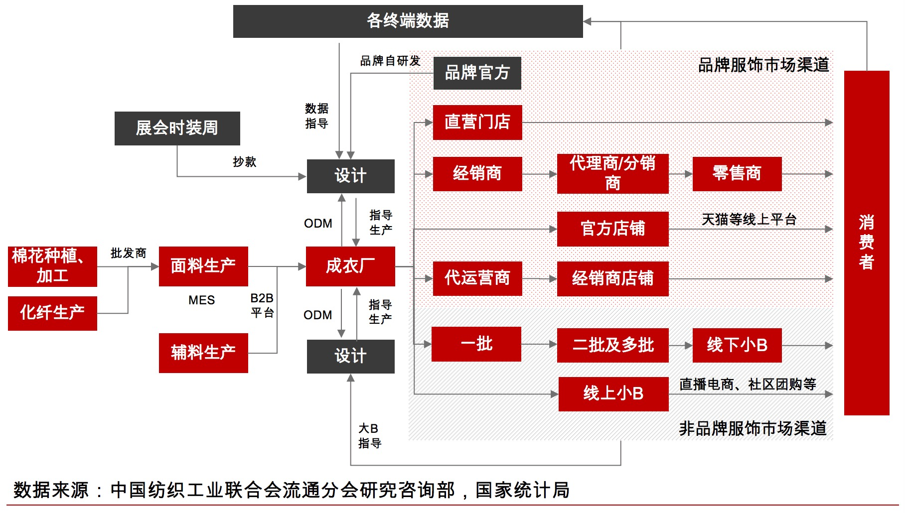

# 供应链管理SCM项目

供应链管理，企业内部使用。

从技术角度出发，主要是XX项目，真个项目体系主要注重的 **\[高一致性以及信息安全性)，所以整个项目中有很多数据需要加密解密操作。并且由于其中很多流程会比较复杂。因为涉及到不同的借贷，\]** 所以会选用领域驱动设计 (DDD) 作为整个项目的工程方法论。并且整个项目采用微服务的架构风格进行设计。

服装快销

## \[信用平台类别介绍\]

* 优势
  * 。。。
* 劣势
  * 。。。

## 业务流程

### 角色

#### 品牌方

#### 供应商

#### 设计

#### 代理商

#### 经销商

#### 消费者

## 技术架构图

## 业务架构图

## 网络拓扑图

## 核心业务流程梳理

## 开发环境以及操作

### 前置知识体系

Java基础、HTML、CSS、JavaScript、Spring、SpringMVC、SpringBoot、Sprint Cloud Alibaba、MyBatis、MySQL、Redis、RocketMQ、Nginx、IDEA、Maven、VMWare、CentOS7.x、DDD、架构设计基础

### 技术栈

#### 后端

* SpringBoot 2.7.8.RELEASE
* Spring Cloud 2022.0.1：微服务基础设施 - 服务注册、服务发现、服务熔断、微服务网关、配置中心
* Spring Cloud Alibaba 2021.0.4.0
* MyBatis Plus：持久层框架和代码生成器
* Lombok：简化实体类开发
* Swagger2：Api接口文档生成工具 / apidoc
* Logback：日志系统
* alibaba-easyexcel：Excel读写
* Spring Data Redis：Spring项目中访问Redis缓存 / 项目中会对与Redis的使用进行再封装
* OpenFegin：基于HTTP协议的客户端，用来实现远程调用
* SpringTask：定时任务

#### 数据库和中间件

* MySQL 8：关系型数据库
* 管理工具：Navicat
* Reids 6：缓存
* 管理工具：RedisDesktopManager
* RocketMQ 4.7.0：消息中间件

#### 三方接口

* 阿里云短信：短信网关 (华为云)
* 阿里云OSS：分布式文件存储 (可能会更新为华为云)

#### 前端

* Node.js JavaScript 运行环境
* ES6：JavaScript的模块化版本
* axios：Ajax工具
* Vue.js：web 界面的渐进式框架
* Element-UI：前端组件库
* 模块化开发：解决JavaScript变量全局空间污染问题
* NPM：模块资源管理器
* vue-element-admin：基于Vue.js的后台管理系统UI集成方案
* NuxtJS：基于Vue.js构建的服务器端渲染应用的轻量级框架

### 团队构成以及背景

**高配版：**

* 产品团队
  * 一位产品总监
  * 产线上至少3~4位产品经理
  * 每个产品经理配备4位左右产品专员或者策划
* 研发团队
  * 一位技术总监
  * 一位架构师
  * 3~4位技术经理
  * 3~4位技术专家
  * 每个技术经理带2~3个小组进行模块开发
  * 每组1位高工或者资深，2位中级，2~3位初级

**低配版：**

* 产品团队
  * 一位资深产品经理
  * 配备4位左右产品专员或者策划
* 研发团队
  * 一位架构师
  * 10+研发
  * 高工比例3~4位

## 建模与设计的流程
